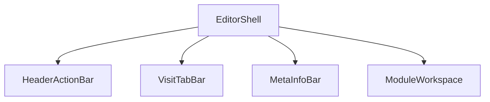
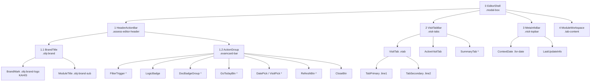
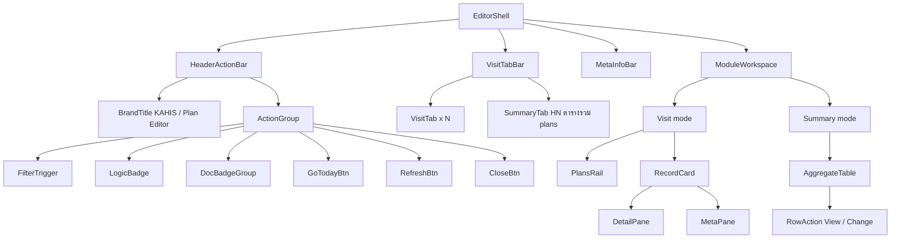
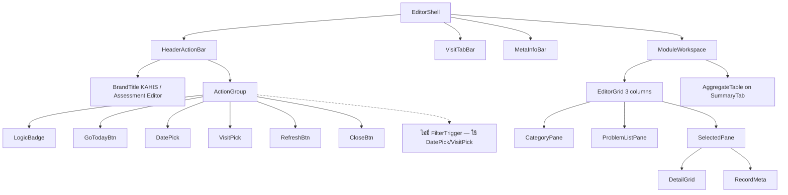
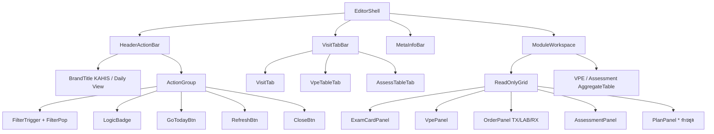
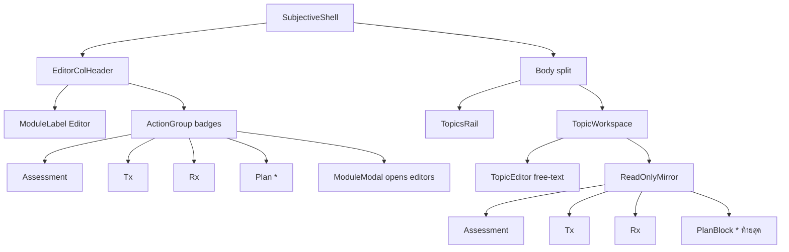
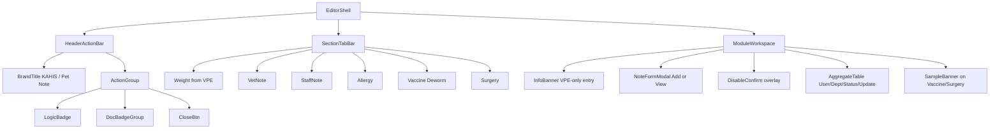

```mermaid
flowchart TB
  Shell[EditorShell]
  Shell --> Head[HeaderActionBar]
  Shell --> Tabs[VisitTabBar]
  Shell --> Meta[MetaInfoBar]
  Shell --> Work[ModuleWorkspace]

  Head --> Brand[BrandTitle KAHIS / Vital and PE Editor]
  Head --> Act[ActionGroup]
  Act --> L[LogicBadge]
  Act --> C[CloseBtn]
  Note1[DatePick/VisitPick/GoToday ซ่อนใน mock]
  Act -.-> Note1

  Tabs --> VT[VisitTab]
  Tabs --> Basic[BasicTableTab]
  Tabs --> Full[FullTableTab]

  Work --> Grid[EditorGrid]
  Grid --> Forms[FormsRail]
  Grid --> FormEd[FormEditorPane]
  Grid --> MPane[MetaPane]
  FormEd --> Nav[SectionNav]
  FormEd --> Clin[ClinicalSections]
  Work --> Agg[Aggregate tables + TableFilterBar]
```

# KAHIS — Editor UI Shell Map

แผนที่ชื่อเรียกส่วน UI (Logical name + CSS class) ให้ใช้ร่วมกันทุกโมดูล  
อ้างอิงต้นแบบขนาด shell จาก **Plan Editor** · ไฟล์คู่: `exam_card_logic_flowchart.md`

**ขนาดมาตรฐาน EditorShell:** width `min(1400px, 100%)` · height `min(95vh, 920px)` · radius `16px` · padding `14px 16px 16px` · class `.modal-box`

**หมายเหตุ:** Logical name = ชื่อตอนคุย · Class = ชื่อใน HTML ปัจจุบัน · `*` = มีบางโมดูล · Mock Tab 1 = DVM ที่ login

---

## วิธีวางข้อมูลในไฟล์นี้ (แบบตาราง + Mermaid)

ทุกหัวข้อโครง UI ใช้**ลำดับเดียวกัน** — อ่านจากบนลงล่าง:

| ลำดับ | บล็อกใน `.md` | ทำหน้าที่ | ใครใช้ |
| :---: | :--- | :--- | :--- |
| **1** | หัวข้อสั้น + ไฟล์อ้างอิง | รู้ว่ากำลังดูโมดูลไหน | ทุกคน |
| **2** | **Mermaid** (`flowchart` / `mindmap`) | เห็นลำดับชั้น / ความสัมพันธ์ | รีวิวภาพรวม · พรีเซนต์ |
| **3** | **ตาราง Layer** | อ้างชื่อ Logical ↔ CSS ↔ หน้าที่ | implement / คุยสเปก |
| **4** | ตาราง CSS ค่าสำคัญ *(ถ้ามี)* | ตัวเลขสี/ขนาดที่ต้องตั้ง | ตอนจัด UI ให้ตรงกัน |
| **—** | ไม่ใส่ ASCII กล่อง `┌─┐` เป็นหลัก | ดูแลยาก · ไม่สากล | — |

### ทำไมเรียงแบบนี้

```
[ ภาพ Mermaid ]     ← สมองจับโครงก่อน
       ↓
[ ตาราง Layer ]     ← ไปหาชื่อ/class ที่พูดถึงในภาพ
       ↓
[ ตาราง CSS ]       ← ตอนลงมือจัดสไตล์ค่อยเปิด
```

- **Mermaid อยู่บนก่อนตาราง** เพราะเป็น “แผนที่”  
- **ตารางอยู่ถัดมา** เพราะเป็น “พจนานุกรมชื่อ” — คอลัมน์ `Layer` โยงกับระดับในภาพ (0 = shell, 1 = แถวถัดลงมา)  
- **CSS แยกตอนท้ายหัวข้อหรือรวมที่ §0.1** เพื่อไม่ให้ภาพ/ชื่อปนกับตัวเลข

### เทมเพลตคัดลอกตอนเพิ่มโมดูลใหม่

````md
## N. ชื่อโมดูล

**ไฟล์:** `path/to/file.html` · **ModuleTitle:** `…`

### โครง (Mermaid)



### ตาราง Layer

| Layer | Logical name | CSS | หมายเหตุ |
| :---: | :--- | :--- | :--- |
| 0 | EditorShell | `.modal-box` | กรอบ modal |
| 1 | … | … | … |

### ค่า CSS ที่ต่างจากมาตรฐาน *(ถ้ามี)*

| ส่วน | Property | ค่า | เหตุผล |
| :--- | :--- | :--- | :--- |
| … | … | … | … |
````

---

## 0. โครงกลางร่วม (Shared Shell)

### โครง (Mermaid)



### ตาราง Layer (ทุกโมดูลใช้ชื่อชุดนี้)

| Layer | Logical name | CSS | หน้าที่ |
| :---: | :--- | :--- | :--- |
| 0 | **EditorShell** | `.modal-box` | กรอบ modal หลัก |
| 1 | **HeaderActionBar** | `.assess-editor-header` | แถวบนสุดเหนือ tabs |
| 1.1 | **BrandTitle** | `.obj-brand` | กลุ่มแบรนด์ซ้าย |
| 1.1.a | **BrandMark** | `.obj-brand-logo` | ข้อความ `KAHIS` |
| 1.1.b | **ModuleTitle** | `.obj-brand-sub` | ชื่อโมดูล |
| 1.2 | **ActionGroup** | `.examcard-bar` | กลุ่มปุ่มขวา |
| 1.2.a | **FilterTrigger** | `.obj-filter-trigger` | ปุ่ม Filters (+ mode chip) |
| 1.2.b | **FilterPop** | `.obj-filter-pop` | แผงโหมด Date / DVM / Dept |
| 1.2.c | **LogicBadge** | `.logic-badge` | เปิด Logic / Manual |
| 1.2.d | **DocBadgeGroup** | `.doc-badge-group` | ปุ่มเปิด `.md` |
| 1.2.e | **DocBadge** | `.doc-badge` | ปุ่มเอกสารรายไฟล์ |
| 1.2.f | **GoTodayBtn** | `.examcard-btn-out` | กลับวันนี้ |
| 1.2.g | **DatePick** | `.examcard-pick` | input วันที่ (แบบเก่า) |
| 1.2.h | **VisitPick** | `.examcard-select` | select ประวัติวัน (แบบเก่า) |
| 1.2.i | **RefreshBtn** | `.examcard-go` | รีเฟรช |
| 1.2.j | **CloseBtn** | `.modal-close` | ปิด editor |
| 2 | **VisitTabBar** | `.visit-tabs` | แถบ visit |
| 2.a | **VisitTab** | `.vtab` | แท็บ visit หนึ่งใบ |
| 2.b | **ActiveVisitTab** | `.vtab.active` | แท็บที่เลือก |
| 2.c | **SummaryTab** | `.vtab` แบบ HN / ตาราง | แท็บสรุปหรือตาราง |
| 2.d | **TabPrimary** | `.line1` | บรรทัดบนในแท็บ |
| 2.e | **TabSecondary** | `.line2` | บรรทัดล่างในแท็บ |
| 3 | **MetaInfoBar** | `.visit-topbar` | แถว for-date + last update |
| 3.a | **ContextDate** | `.for-date` | วันที่บริบทของ visit |
| 3.b | **LastUpdateInfo** | ข้อความขวาใน topbar | เวลา/คนอัปเดตล่าสุด |
| 4 | **ModuleWorkspace** | `.tab-content` | พื้นที่ทำงานของแท็บ |

> ค่า CSS ราย property อยู่ที่ **§0.1** ด้านล่าง (ไม่ปนในตาราง Layer)

---

## 0.1 ค่า CSS มาตรฐานของ Shell (อิง Plan Editor)

ใช้เป็นต้นแบบเมื่อจัด UI ให้โมดูลอื่น — กำหนดเฉพาะค่าที่**จำเป็นต่อการจัดวาง / ขนาด / สีหลัก**  
พื้นหลัง modal overlay: `rgba(0,0,0,.4)` · z-index overlay ≈ `1000`

### Tokens สี / พื้น (แนะนำ `:root`)

| Token | ค่า | ใช้กับ |
| :--- | :--- | :--- |
| `--qb-bg` | `#F0F2F5` | พื้น EditorShell |
| `--qb-surface` | `#FFFFFF` | การ์ด / MetaInfoBar |
| `--qb-border` | `#E5E7EB` | เส้นขอบทั่วไป |
| `--qb-muted` | `#676D75` | ข้อความรอง |
| `--qb-shadow` | `0 4px 24px rgba(0,0,0,.08)` | FilterPop / การ์ดเบา |
| Brand green | `#22c55e` | BrandMark · FilterTrigger · Search |
| Brand text | `#1f2937` | ModuleTitle |
| Tab accent (visit) | `#2563eb` | เส้นใต้ VisitTabBar / ActiveVisitTab |
| Tab accent (summary) | `#16a34a` | SummaryTab (เช่น ตารางรวม Plan) |
| Close / danger | `#dc2626` + border `#fca5a5` | CloseBtn |
| Logic olive | bg `#f5f7f0` · border `#a0b070` · text `#556b2f` | LogicBadge |

### EditorShell — `.modal-box`

| Property | ค่า | เหตุผล |
| :--- | :--- | :--- |
| `width` | `min(1400px, 100%)` | กว้างมาตรฐานทุกโมดูล |
| `height` | `min(95vh, 920px)` | สูงไม่ล้นจอ · เพดาน 920px |
| `border-radius` | `16px` | มุม modal |
| `padding` | `14px 16px 16px` | ระยะขอบใน |
| `background` | `#F0F2F5` / `var(--qb-bg)` | พื้นเทาอ่อน |
| `box-shadow` | `0 20px 60px rgba(0,0,0,.28)` | ลอยเหนือหน้า |
| `display` | `flex` · `flex-direction: column` | เรียง Header → Tabs → Meta → Workspace |
| `min-height` | `0` | ให้ลูก flex หด/เลื่อนได้ |
| `overflow` | `hidden` | เลื่อนภายใน workspace ไม่ทั้ง shell |

### HeaderActionBar — `.assess-editor-header`

| Property | ค่า | เหตุผล |
| :--- | :--- | :--- |
| `display` | `flex` | ซ้าย Brand / ขวา Action |
| `align-items` | `center` | จัดกึ่งกลางแนวตั้ง |
| `justify-content` | `space-between` | ดันสองฝั่ง |
| `gap` | `12px` | กันชนเมื่อจอย่อ |
| `margin-bottom` | `10px` | ห่างจาก VisitTabBar |
| `flex-shrink` | `0` | หัวไม่ถูกบีบเมื่อ workspace โต |

### BrandTitle — `.obj-brand` / `.obj-brand-logo` / `.obj-brand-sub`

| Property | ค่า | เหตุผล |
| :--- | :--- | :--- |
| `.obj-brand` `display` / `gap` | `flex` · `12px` | เว้นระหว่าง KAHIS กับชื่อโมดูล |
| `font-weight` | `700` | น้ำหนักแบรนด์ |
| `font-size` | `22px` | ขนาดชื่อมาตรฐาน |
| `letter-spacing` | `-0.02em` | แน่นนิดให้ดูหัวข้อ |
| `line-height` | `1.1` | ความสูงแถวหัวไม่พุ่ง |
| BrandMark `color` | `#22c55e` | เขียว KAHIS |
| ModuleTitle `color` | `#1f2937` | เทาเข้มอ่านชัด |

### ActionGroup — `.examcard-bar`

| Property | ค่า | เหตุผล |
| :--- | :--- | :--- |
| `display` | `flex` · `align-items: center` | เรียงปุ่มแนวนอน |
| `gap` | `8px` | ระยะระหว่างปุ่ม |
| `flex-wrap` | `wrap` | ขึ้นบรรทัดเมื่อจอแคบ |
| `position` | `relative` | ให้ FilterPop วาง absolute ได้ |

### FilterTrigger — `.obj-filter-trigger`

| Property | ค่า | เหตุผล |
| :--- | :--- | :--- |
| `background` / `color` | `#22c55e` / `#fff` | ปุ่มหลักเขียว |
| `border` | `none` | โปร่ง ไม่มีขอบ |
| `border-radius` | `999px` | pill |
| `padding` | `8px 16px` | ขนาดคลิก |
| `font-size` / `font-weight` | `13px` / `600` | อ่านง่าย |
| `.has-mode::after` | chip จาก `data-mode-label` | แสดงโหมดปัจจุบัน (By Date…) |
| chip `font-size` | `11px` | ย่อยกว่าตัวปุ่ม |
| chip `background` | `rgba(255,255,255,.22)` | โปร่งบนพื้นเขียว |

### FilterPop — `.obj-filter-pop`

| Property | ค่า | เหตุผล |
| :--- | :--- | :--- |
| `position` | `absolute` · `top: calc(100% + 8px)` · `right: 0` | หล่นใต้ปุ่มชิดขวา |
| `width` | `360px` | ความกว้างแผง |
| `padding` | `14px` | ระยะใน |
| `border-radius` | `12px` | มุมแผง |
| `border` | `1px solid #e5e7eb` | ขอบอ่อน |
| `z-index` | `80` | เหนือเนื้อหาใน shell |
| `display` | `none` → `.show { display:block }` | เปิด/ปิด |
| section `active-mode` bg | `#f0fdf4` | ไฮไลต์โหมดที่เลือก |
| Search btn | bg `#22c55e` · pad `8px 12px` · radius `8px` | ปุ่มค้นในแผง |
| Cal btn | กว้าง `38px` · border `#d1d5db` | ไอคอนปฏิทิน |

### LogicBadge — `.logic-badge`

| Property | ค่า | เหตุผล |
| :--- | :--- | :--- |
| `padding` | `8px 16px` | ขนาดคล้าย Filter แต่ไม่เด่นเท่า |
| `border` | `1px solid #a0b070` | โทน olive |
| `border-radius` | `999px` | pill |
| `background` / `color` | `#f5f7f0` / `#556b2f` | พื้นอ่อน · ตัวอักษเข้ม |
| `font-size` / `font-weight` | `13px` / `500` | มาตรฐานปุ่มหัว |
| `.dot` | `8×8px` · `#556b2f` | จุดนำหน้า |

### DocBadge — `.doc-badge` / `.doc-badge-group`

| Property | ค่า | เหตุผล |
| :--- | :--- | :--- |
| group `gap` | `6px` · `flex-wrap: wrap` | เรียงปุ่ม .md |
| `padding` | `7px 12px` | เล็กกว่า Logic เล็กน้อย |
| `border` | `1px solid #cbd5e1` | ขอบเทา |
| `border-radius` | `999px` | pill |
| `font-size` | `12px` · color `#475569` | รองจาก Logic |
| `.md-tag` | `9px` · bg `#e2e8f0` | ป้าย `.md` |
| `:hover` | border/olive · bg `#f5f7f0` | สอดคล้อง Logic |

### GoTodayBtn — `.examcard-btn-out`

| Property | ค่า | เหตุผล |
| :--- | :--- | :--- |
| `padding` | `8px 14px` | ขนาดปุ่มหัว |
| `border` | `1px solid #86efac` | เขียวอ่อน |
| `border-radius` | `8px` | มุมมน (ไม่ใช่ pill) |
| `background` / `color` | `#fff` / `#16a34a` | ขาว · ตัวเขียว |
| `font-size` / `font-weight` | `13px` / `500` | มาตรฐาน |

### DatePick / VisitPick (Assessment — แบบเก่า)

| Property | ค่า | เหตุผล |
| :--- | :--- | :--- |
| DatePick `.examcard-pick` | pad `8px 12px` · border `#93c5fd` · radius `8px` · color `#2563eb` | โทนวัน/ฟ้า |
| VisitPick `.examcard-select` | pad `7px 10px` · border `#d1d5db` · radius `8px` · `max-width: 280px` | ไม่กินพื้นที่หัว |

### RefreshBtn — `.examcard-go`

| Property | ค่า | เหตุผล |
| :--- | :--- | :--- |
| `padding` | `6px` | ไอคอนอย่างเดียว |
| `border` / `background` | `none` / `transparent` | ไม่มีกรอบ |
| `color` | `#9ca3af` → hover `#6b7280` | ไอคอนรอง |

### CloseBtn — `.modal-close`

| Property | ค่า | เหตุผล |
| :--- | :--- | :--- |
| `padding` | `6px 12px` | ปุ่ม ✕ |
| `border` | `1px solid #fca5a5` | แดงอ่อน |
| `border-radius` | `8px` | มุมมน |
| `background` / `color` | `#fff` / `#dc2626` | ขาว · ตัวแดง |
| `font-size` / `font-weight` | `13px` / `500` | มาตรฐาน |
| `:hover` | bg `#fef2f2` | ไฮไลต์ปิด |

### VisitTabBar — `.visit-tabs`

| Property | ค่า | เหตุผล |
| :--- | :--- | :--- |
| `display` / `gap` | `flex` · `2px` | แท็บชิดกัน |
| `border-bottom` | `2px solid #2563eb` (หรือ `#16a34a` เมื่ออยู่ Summary) | เส้นเน้นแท็บ |
| `flex-shrink` | `0` | ไม่ถูกบีบความสูง |

### VisitTab — `.vtab`

| Property | ค่า | เหตุผล |
| :--- | :--- | :--- |
| `padding` | `6px 14px` | พื้นที่คลิก |
| `border-radius` | `8px 8px 0 0` | มุมบนเท่านั้น |
| `font-size` / `line-height` | `11px` / `1.3` | สองบรรทัดในแท็บ |
| `min-width` | `130px` | ความกว้างขั้นต่ำ |
| `border` | `1px solid #e5e7eb` · ไม่มีขอบล่าง | เชื่อมกับเนื้อหา |
| `border-top` | `3px solid transparent` | จองที่ให้ active |
| default bg / color | `#f9fafb` / `#6b7280` | แท็บไม่เลือก |
| **Active** bg / color | `#fff` / `#2563eb` | แท็บเลือก |
| **Active** `border-top-color` | `#2563eb` | แถบบนสี accent |
| **Active** `border-bottom` | `2px solid #fff` | ทับเส้น VisitTabBar |
| `.line1::before` (active) | `●` | จุดนำหน้า |
| `.new-badge` | bg `#dc2626` · `9px` · pad `1px 5px` | ป้าย NEW |
| Summary `.add-visit` | bg `#f0fdf4` · color `#16a34a` · border `#86efac` | แท็บตาราง/HN |
| `.disabled` | `opacity: .72` · `pointer-events: none` | แท็บยังไม่เปิดใช้ |

### MetaInfoBar — `.visit-topbar`

| Property | ค่า | เหตุผล |
| :--- | :--- | :--- |
| `display` | `flex` · `justify-content: space-between` | ซ้ายวันที่ · ขวาอัปเดต |
| `padding` | `6px 16px` | แถวบาง |
| `background` | `#fff` | พื้นขาวต่อจากแท็บ |
| `border-left/right` | `1px solid #e5e7eb` | ขอบข้างต่อ workspace |
| `font-size` / `color` | `11px` / `#9ca3af` | ข้อความเมตา |
| `flex-shrink` | `0` | ไม่ถูกบีบ |
| `b` | color `#374151` | ค่าที่เน้น (เวลา/ชื่อ) |
| ContextDate `.for-date` | color `#1d4ed8` · `font-weight: 600` | วันที่บริบทสีฟ้า |

### ModuleWorkspace — `.tab-content` (โครงร่วม)

| Property | ค่า | เหตุผล |
| :--- | :--- | :--- |
| `flex` | `1` | กินพื้นที่ที่เหลือใน shell |
| `min-height` | `0` | เปิดทาง `overflow` ลูก |
| `overflow` | ตามโมดูล (`hidden` / `auto`) | Plan = hidden + เลื่อนใน pane |
| (Plan) `display` / `padding` | `flex` · `10px 0 0` | เว้นจาก MetaInfoBar |

> รายละเอียด grid ภายใน (PlansRail, EditorGrid, ReadOnlyGrid) กำหนดในสเปกโมดูลนั้น — ไฟล์นี้โฟกัส **shell เหนือ workspace** เป็นหลัก

### Checklist เมื่อจัด header ให้โมดูลใหม่

1. `.modal-box` ครบขนาด + flex column + `min-height: 0`  
2. Brand `22px/700` · เขียว `#22c55e` + เทา `#1f2937`  
3. Header `gap 12px` · `margin-bottom 10px` · `flex-shrink: 0`  
4. ActionGroup `gap 8px` · `flex-wrap: wrap`  
5. VisitTabBar + VisitTab ตามตาราง (รวม `min-width: 130px`)  
6. MetaInfoBar `6px 16px` · ContextDate ฟ้า  

---

## 1. Plan Editor

**ไฟล์:** `NP/plan/plan_editor.html` · **ModuleTitle:** `Plan Editor`

### โครง (Mermaid)



### ตาราง Layer (เฉพาะส่วนที่เพิ่มจาก Shared)

| Layer | Logical name | CSS | หมายเหตุ |
| :---: | :--- | :--- | :--- |
| 4.1 | **PlansRail** | `.plans-rail` | aside รายการแผน |
| 4.1.a | **PlansList** | `#plans-list` | รายการใน rail |
| 4.1.b | **PlanItem** | item ใน list | เลือกรายการ |
| 4.2 | **RecordCard** | `#main-card` | Detail + Meta ชุดเดียวกัน |
| 4.2.a | **RecordBand** | `.record-band` | หัวการ์ด + Delete/Disable |
| 4.2.b | **DetailPane** | `.detail-pane` | Title · Level · Form |
| 4.2.c | **MetaPane** | `.meta-pane` | Schedule · DVM · Note · Apply |
| 4.3 | **AggregateTable** | `.data-table` | ตารางรวม (SummaryTab) |
| 4.3.a | **RowAction** | ปุ่มในแถว | View / Change |

---

## 2. Assessment Editor

**ไฟล์:** `NP/assessment/assessment_editor.html` · **ModuleTitle:** `Assessment Editor`

### โครง (Mermaid)



### ตาราง Layer (เฉพาะส่วนที่เพิ่มจาก Shared)

| Layer | Logical name | CSS | หมายเหตุ |
| :---: | :--- | :--- | :--- |
| 4.1 | **EditorGrid** | `.grid` | 3 คอลัมน์ |
| 4.1.a | **CategoryPane** | แผง Categories | ซ้าย |
| 4.1.b | **ProblemListPane** | แผง PDT list | กลาง |
| 4.1.c | **SelectedPane** | Selected + Detail + Meta | ขวา |
| 4.1.d | **DetailGrid** | `.detail-grid` | ฟิลด์ PDT |
| 4.1.e | **RecordMeta** | meta ขวา | DVM / Dept / Note |
| 4.2 | **AggregateTable** | ตาราง HN | SummaryTab |

---

## 3. Vital & PE Editor

**ไฟล์:** `NP/vital_pe/vital_pe_editor.html` · **ModuleTitle:** `Vital & PE Editor`

### โครง (Mermaid)



### ตาราง Layer (เฉพาะส่วนที่เพิ่มจาก Shared)

| Layer | Logical name | CSS | หมายเหตุ |
| :---: | :--- | :--- | :--- |
| 4.1 | **FormsRail** | `.forms-list` | รายการฟอร์มซ้าย |
| 4.2 | **FormEditorPane** | Form Editor | กรอกฟิลด์ |
| 4.2.a | **SectionNav** | `.section-nav` | กระโดด section |
| 4.2.b | **ClinicalSections** | กลุ่มฟิลด์ | 47 fields |
| 4.3 | **MetaPane** | Record Meta ขวา | Confirm |
| 2.c | **BasicTableTab / FullTableTab** | `.vtab` พิเศษ | Aggregate |
| 4.4 | **TableFilterBar** | filter ในตาราง | คนละชั้นกับ FilterTrigger หัว |

---

## 4. Objective (Daily View)

**ไฟล์:** `NP/objective/objective.html` · **ModuleTitle (แสดง):** `Daily View` · โมดูลเรียก **Objective**

### โครง (Mermaid)



### ตาราง Layer (เฉพาะส่วนที่เพิ่มจาก Shared)

| Layer | Logical name | CSS | หมายเหตุ |
| :---: | :--- | :--- | :--- |
| 4.1 | **ReadOnlyGrid** | `.grid` | 4 คอลัมน์ (+ Plan เมื่อเพิ่ม) |
| 4.1.a | **ExamCardPanel** | แผง Exam Card | free-text topics |
| 4.1.b | **VpePanel** | แผง VPE | snapshot ตามเวลา |
| 4.1.c | **OrderPanel** | แผง TX/LAB/RX | |
| 4.1.d | **AssessmentPanel** | แผง Assessment | PDT + Summary |
| 4.1.e | **PlanPanel** * | แผงท้ายสุด | form + title + meta |
| 4.1.f | **PanelInfoBtn** | ปุ่ม `i` | อธิบายแหล่งข้อมูล |

---

## 5. Subjective (Exam Card authoring)

**ไฟล์:** `NP/subjective/subject.html` · `subjective_editor.html`  
โครงต่างจาก EditorShell เล็กน้อย แต่ใช้ Logical name ให้สอดคล้อง

### โครง (Mermaid)



### ตาราง Layer

| Layer | Logical name | CSS / หมายเหตุ |
| :---: | :--- | :--- |
| 0 | **SubjectiveShell** | `.app` / editor layout |
| 1 | **EditorColHeader** | หัวคอลัมน์ขวา + badges |
| 1.2 | **ActionGroup** | Assessment · Tx · Rx · Plan* |
| 2 | **TopicsRail** | `#topicsNav` |
| 3 | **TopicWorkspace** | พื้นที่ topic |
| 3.a | **TopicEditor** | free-text |
| 3.b | **ReadOnlyMirror** | สะท้อนโมดูลอื่น |
| 3.c | **PlanBlock** * | ท้าย card · form+title+meta |
| — | **ModuleModal** | เปิด Assessment/Tx/Rx/Plan |

---

## 6. Pet Note (HN-level)

**ไฟล์:** `NP/petnote/petnote.html` · **ModuleTitle:** `Pet Note` · เอกสาร: `petnote.md`

> ระดับ **HN** (ไม่ผูก visit เดียว) · Section tabs แทน Visit tabs · accent ชมพู

### โครง (Mermaid)



### ตาราง Layer (เฉพาะส่วนที่เพิ่มจาก Shared)

| Layer | Logical name | CSS | หมายเหตุ |
| :---: | :--- | :--- | :--- |
| 2 | **SectionTabBar** | `.visit-tabs` | reuse VisitTabBar · หัวข้อโมดูล |
| 2.a | **SectionTab** | `.vtab` | accent `#db2777` |
| 4.1 | **NoteFormModal** | `#note-form-modal` | Add (Apply) · Edit = อ่านอย่างเดียว + Disable |
| 4.2 | **DisableConfirm** | `#disable-confirm` | confirm ก่อน Disable |
| 4.3 | **LevelTags** | `.level-tag` | เหมือน Plan · ล็อกตอน View |
| 4.4 | **AggregateTable** | `.data-table` | Edit ดูรายการ · ไม่แก้ข้อความ |
| 4.5 | **SampleBanner** | `.sample-banner` | ข้อมูลตัวอย่าง Items |

---

## 7. ActionGroup เปรียบเทียบข้ามโมดูล

| ปุ่ม | Plan | Assessment | VPE | Objective | Subjective | Pet Note |
| :--- | :---: | :---: | :---: | :---: | :---: | :---: |
| FilterTrigger | ✓ | — (Date/VisitPick) | — (ซ่อน) | ✓ | — | — |
| LogicBadge | ✓ | ✓ | ✓ | ✓ | ตาม modal | ✓ |
| DocBadgeGroup | ✓ | — | — | — | — | ✓ |
| GoTodayBtn | ✓ | ✓ | ซ่อน | ✓ | — | — |
| DatePick / VisitPick | — | ✓ | ซ่อน | — | — | — |
| RefreshBtn | ✓ | ✓ | ซ่อน | ✓ | — | — |
| CloseBtn | ✓ | ✓ | ✓ | ✓ | ตาม modal | ✓ |

---

## 8. กฎการตั้งชื่อเมื่อคุยงาน

1. พูด **Logical name** ก่อน แล้ววงเล็บ class เช่น `HeaderActionBar (.assess-editor-header)`  
2. อ้าง **Layer** จากตารางเมื่อต้องการชี้ระดับ (เช่น Layer 1 = เหนือ tabs)  
3. อย่าเรียกสลับ header กับ VisitTabBar — header = เฉพาะเหนือ tabs  
4. ตารางรวม = **AggregateTable** · แท็บตาราง = **SummaryTab** / **TableTab**  
5. Objective อ่านอย่างเดียว = **…Panel** · editor แก้ไข = **…Pane**  
6. เพิ่ม UI ใหม่ → ใส่ Mermaid + แถวตารางในไฟล์นี้ก่อนลง HTML  

---

## 9. ประวัติ

| วันที่ | เปลี่ยน |
| :--- | :--- |
| 2026-08-08 | สร้างไฟล์ — ร่าง UI shell + ชื่อเรียกทุกโมดูล อิง Plan เป็นต้นแบบขนาด |
| 2026-08-08 | เพิ่ม §0.1 ค่า CSS มาตรฐานของ Shell |
| 2026-08-08 | กำหนดลำดับวางข้อมูล: Mermaid → ตาราง Layer → CSS · แปลง §0–5 จาก ASCII เป็นรูปแบบนี้ |
| 2026-08-25 | เพิ่ม §6 Pet Note (HN-level · Section tabs) |
| 2026-08-25 | §6 — ลำดับแท็บ Staff/Allergy · Edit view-only · DisableConfirm · เอา MetaInfoBar |
