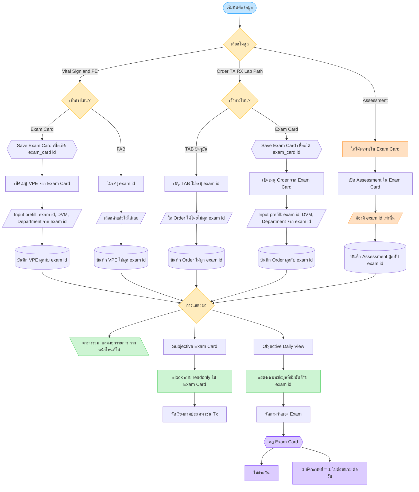

# Exam Card — Entry & Display Logic

Flowchart สำหรับจุดเข้าบันทึก (VPE / Order / Assessment) และการแสดงผล (ตารางรวม / Subjective / Daily View)

## สรุป

| โมดูล | จุดเข้า | exam id |
|---|---|---|
| Vital Sign & PE | Exam Card | มี — Save เพื่อเกิด id แล้ว prefill exam id, DVM, Department |
| Vital Sign & PE | FAB | ไม่ระบุ id — เลือกค่าแล้วใส่ได้เลย |
| Order (TX/RX/Lab/Path) | TAB (ปัจจุบัน) | ไม่ระบุ exam id |
| Order (TX/RX/Lab/Path) | Exam Card | มี — Save เพื่อเกิด id แล้ว prefill exam id, DVM, Department |
| Assessment | Exam Card เท่านั้น | ต้องมี exam id |

### การแสดงผล

- **ตารางรวม** — จากหน้าไหนก็ตาม แสดงรายการทั้งหมด
- **Subjective (Exam Card)** — block แบบ readonly; บางข้อมูลจัดเรียงตามประเภท เช่น Tx
- **Daily View (Objective)** — แสดงข้อมูลที่สัมพันธ์กับ exam id ตามวันของ exam
  - Exam Card ไม่ข้ามวัน
  - 1 สัตวแพทย์ = 1 ใบต่อหน่วย ในแต่ละวัน
