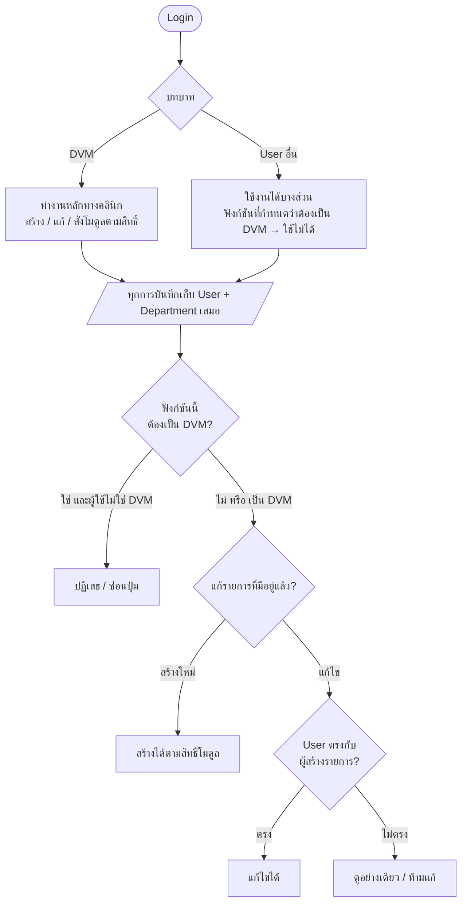
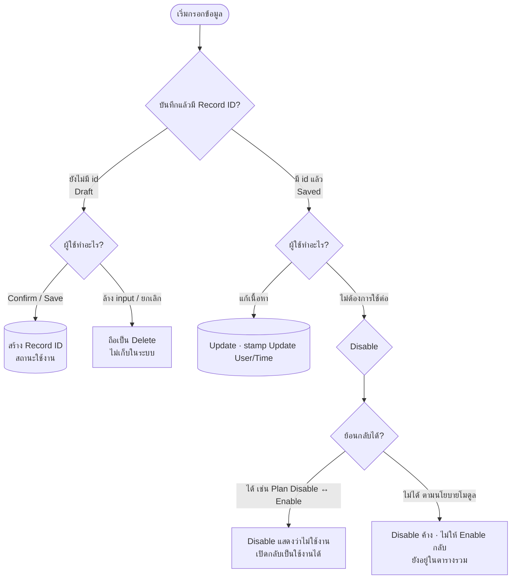
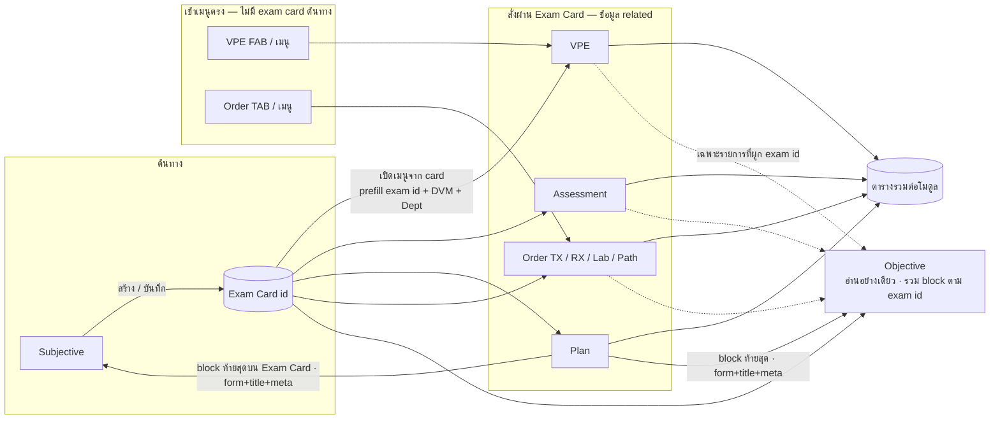
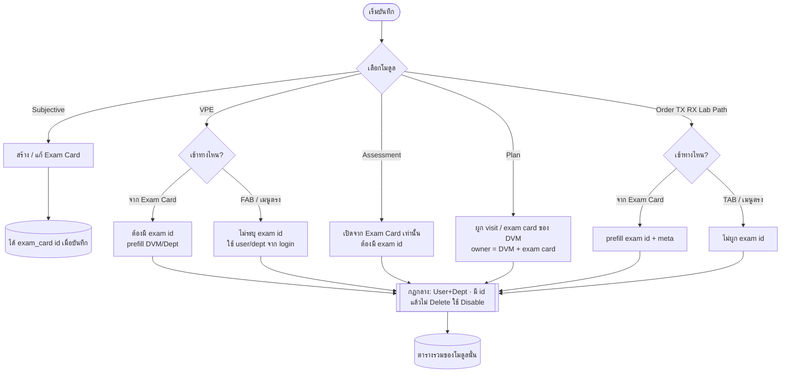

# KAHIS — Exam Card & Module Workflow

เอกสารภาพรวมความสัมพันธ์ระหว่างโมดูล · กฎกลาง (DVM / User / ID / Disable) · จุดเข้าบันทึก · และการแสดงผล  
อ้างอิง mock / สเปกภายใต้ `NP/` (Subjective · VPE · Assessment · Plan · Objective · Order TX/RX/Lab/Path)

---

## 1. คำศัพท์สั้นๆ

| คำ | ความหมาย |
| :--- | :--- |
| **DVM** | สัตวแพทย์ — บทบาทหลักในการ login และทำงานทางคลินิก |
| **User อื่น** | ผู้ใช้ที่ไม่ใช่ DVM (เช่น ผู้ช่วย / แอดมิน) — บางฟังก์ชันใช้ได้ / บางอย่างต้องเป็น DVM |
| **Department** | แผนกที่ผูกกับการบันทึกทุกครั้ง |
| **Exam Card** | ใบตรวจที่สร้างจาก **Subjective** · มี `exam_card id` เป็นกุญแจเชื่อมโมดูลอื่น |
| **Record ID** | รหัสของรายการที่บันทึกแล้ว (เช่น plan id, VPE record id) — **ยังไม่บันทึก = ยังไม่มี id** |
| **Disable** | หลังมี id แล้วไม่ลบออกจากระบบ · ทำเครื่องหมายว่า “ไม่ใช้งาน” (บางอย่างย้อนกลับได้ / บางอย่างไม่ได้) |
| **ตารางรวม (Aggregate)** | ตารางรายการของแต่ละโมดูล — แสดง**ทุกรายการ**ไม่ว่าจะเข้าทาง Exam Card หรือเมนูตรง |
| **Objective** | หน้า**อ่านอย่างเดียว** รวม block จากหลายโมดูลของ exam card นั้นในหน้าเดียว |

---

## 2. กฎกลาง (ใช้ทุกโมดูลที่บันทึกข้อมูล)

### 2.1 ผู้ใช้และสิทธิ์



**สรุปสิทธิ์**

1. **Login หลัก = DVM** · มี user อื่นที่ไม่ถือเป็น DVM  
2. **ทุกการบันทึก** เก็บ **User** และ **Department** เสมอ  
3. **บางฟังก์ชันต้องเป็น DVM** ถึงใช้ได้  
4. **แก้ข้อมูลที่มีอยู่แล้ว** ได้เฉพาะ **user ที่ตรงกับผู้สร้างการบันทึก** (เจ้าของรายการ)  
   - ตัวอย่างชัดใน Plan: เจ้าของ = DVM ของรายการ + exam card ตรง → View แก้ได้ · คนละ DVM = อ่านอย่างเดียว  

> รายละเอียดฟังก์ชันไหน “ต้องเป็น DVM” ให้กำหนดในสเปกของแต่ละโมดูล — กฎข้อนี้เป็นระดับระบบ

### 2.2 ID · Delete · Disable



| สถานะรายการ | มี id? | ลบออกจากระบบ? | พฤติกรรม |
| :--- | :---: | :---: | :--- |
| Draft (ยังไม่บันทึก) | ไม่ | ใช่ (ล้าง = ไม่เก็บ) | ไม่มีแถวในตารางรวม |
| Saved | ใช่ | **ไม่** | แก้ = Update · เลิกใช้ = **Disable** |
| Disabled (ย้อนได้) | ใช่ | ไม่ | แสดงว่าไม่ใช้งาน · Enable กลับได้ |
| Disabled (ย้อนไม่ได้) | ใช่ | ไม่ | แสดงว่าไม่ใช้งาน · ไม่เปิดกลับ |

**หมายเหตุต่อโมดูล (สถานะปัจจุบันของ mock)**

| โมดูล | Draft / Delete | Saved / Disable |
| :--- | :--- | :--- |
| **Plan** | Draft → Delete ได้ · Confirm ได้ id | Disable ↔ Enable (Plan) ได้ · ตาราง Change ไม่ให้ Disable |
| **VPE** | Confirm บันทึก | mock เดิมเน้น admin delete / recreate — **ทิศทางระบบใช้ Disable ตามกฎกลาง** |
| **Assessment** | Confirm จาก Exam Card | ยังไม่ระบุ Disable ใน manual — **ใช้กฎกลางเมื่อ implement** |
| **Order TX/RX/Lab/Path** | ตาม workflow order | ตามกฎกลางเมื่อมี id |

---

## 3. โครงโมดูลและ Exam Card (ภาพรวมระบบ)



### 3.1 Subjective → Exam Card (ต้นทาง)

- **Subjective** คือโมดูลหลักที่**สร้าง Exam Card**  
- เมื่อบันทึก Exam Card ได้ **`exam_card id`**  
- กฎใบตรวจ (จาก logic เดิม):  
  - **ไม่ข้ามวัน**  
  - **1 DVM = 1 ใบต่อหน่วย ต่อวัน** (ตามหน่วยที่ระบบกำหนด)  
- บน Exam Card มี free-text ตาม topic และจุดเปิดโมดูลอื่น (Assessment / Tx / Rx / VPE / Plan ฯลฯ)

### 3.2 สั่งโมดูลผ่าน Exam Card

1. ต้องมี Exam Card ที่บันทึกแล้ว (`exam_card id`)  
2. เปิดโมดูลจากปุ่ม/เมนูบน card  
3. **Prefill:** `exam_card id` · DVM · Department จาก card  
4. บันทึกรายการโมดูล → **related** กับ exam card นั้น  
5. รายการนั้น:
   - แสดงใน **ตารางรวม** ของโมดูล  
   - แสดงบน **Exam Card / Subjective** (block อ่านอย่างเดียวตามประเภท)  
   - แสดงใน **Objective** ของ visit tab นั้น (ถ้าโมดูลนั้นอยู่ใน grid)

### 3.3 สั่งจากเมนูตรง (ไม่มี Exam Card ต้นทาง)

ตัวอย่าง: VPE จาก FAB · Order จาก TAB โดยไม่ผ่าน card  
**ผู้ใช้:** ไม่จำกัดเฉพาะ DVM — ได้เฉพาะ **user ที่ระบบให้สิทธิ์** (mock ตัวอย่างปัจจุบันยังเป็น DVM เป็นหลัก เพราะยังไม่มี UI เมนูตรงแยก role)

| | มี Exam Card ต้นทาง | ไม่มี Exam Card (เมนูตรง) |
| :--- | :--- | :--- |
| ใครสั่งได้ | DVM ที่ทำงานบน card (mock) | User ที่มีสิทธิ์อนุญาต (อาจไม่ใช่ DVM) |
| Prefill exam id | มี | ไม่มี / ว่าง |
| แสดงบน Exam Card / Subjective | ใช่ (related) | **ไม่** — ไม่มี card เป็นต้นทาง |
| แสดงใน Objective ตาม exam id | ใช่ | **ไม่** (ไม่มี id ให้ผูก) |
| แสดงใน **ตารางรวม** | ใช่ | **ใช่** — รวมทุกรายการของโมดูล |

**สร้าง Exam Card:** ได้เฉพาะ **DVM** · User ที่ไม่ใช่ DVM สร้างไม่ได้เลย

---

## 4. จุดเข้าบันทึกตามโมดูล



| โมดูล | จุดเข้า | ผูก exam id? | หมายเหตุ |
| :--- | :--- | :---: | :--- |
| **Subjective** | หน้า Subjective | สร้าง id ของ card เอง | ต้นทางของ related modules |
| **VPE** | Exam Card | ใช่ | แสดงบน card + Objective + ตาราง |
| **VPE** | FAB / เมนู | ไม่ | เฉพาะตารางรวม |
| **Assessment** | Exam Card เท่านั้น | ใช่ | Topic สรุปบน Subjective · panel บน Objective |
| **Plan** | จาก visit / exam card ของ DVM | ใช่ (meta) | ตารางรวม HN · Disable/Enable ที่ editor/เจ้าของ |
| **Order TX/RX/Lab/Path** | Exam Card | ใช่ | แสดงบน card / Objective ตามประเภท |
| **Order TX/RX/Lab/Path** | TAB / เมนู | ไม่ | เฉพาะตารางรวม |

---

## 5. การแสดงผล — ตารางรวม · Exam Card · Objective

```mermaid
flowchart TD
  records[(รายการที่บันทึกแล้ว<br/>ทุกโมดูล)] --> show{ช่องทางแสดง}

  show --> agg[\ตารางรวมต่อโมดูล<br/>แสดงทุกรายการ<br/>มี/ไม่มี exam id/]
  show --> card[Subjective / Exam Card]
  show --> obj[Objective Daily View]

  card --> cardRule{รายการมี exam id<br/>ตรงกับใบนี้?}
  cardRule -->|ใช่| cardBlock[Block อ่านอย่างเดียว<br/>จัดตามประเภท เช่น Tx / Assessment]
  cardRule -->|ไม่ / ไม่มี id| hideCard[ไม่แสดงบนใบนี้]

  obj --> objRule{รายการ related<br/>กับ exam id ของ tab?}
  objRule -->|ใช่| objBlock[แสดงเป็น block ใน grid<br/>Exam Card | VPE | TX/LAB/RX | Assessment]
  objRule -->|ไม่| hideObj[ไม่ขึ้นใน visit นั้น]

  agg --> filter[Filter / ค้นหา / Active-Inactive ตามโมดูล]
```

### 5.1 ตารางรวม (Aggregate)

- รวม**ทุกรายการบันทึก**ของโมดูลนั้น  
- ไม่สนว่าเข้าจาก Exam Card หรือเมนูตรง  
- เป็นที่เดียวที่เห็นรายการที่**ไม่มี exam id**

### 5.2 Subjective / Exam Card

- แสดงเฉพาะข้อมูลที่ **related กับ exam id ของใบนั้น**  
- มักเป็น block อ่านอย่างเดียว (เช่น สรุป Assessment · รายการ Tx)  
- การแก้จริงทำในโมดูลต้นทาง (และต้องเป็นเจ้าของรายการตามกฎกลาง)

### 5.3 Objective

- **ไม่ใช่ editor** — รวมภาพเพื่อดู  
- แต่ละ visit tab ≈ หนึ่ง Exam Card  
- แสดง input / ผลจากโมดูลเป็น **block ในหน้าเดียว** (เช่น Exam Card text · VPE snapshot · Order · Assessment)  
- Filter ตามวัน / DVM / Department ตามสเปก Objective  
- รายการที่ไม่มี exam id **ไม่โผล่**ใน grid ของ card  

---

## 6. Workflow ตัวอย่าง (อ่านจบแล้วใช้ได้)

### Event A — DVM สร้าง Exam Card แล้วสั่ง VPE จาก card

1. Login เป็น DVM → เปิด Subjective → บันทึก Exam Card → ได้ `exam_card id`  
2. เปิด VPE จาก card → prefill id + DVM + Dept  
3. Confirm → ได้ record id ของ VPE · เก็บ User + Dept  
4. เห็นใน: Exam Card · Objective · ตารางรวม VPE  

### Event B — สั่ง VPE จากเมนูตรง (ไม่มี card)

1. เปิด VPE จาก FAB → ไม่มี exam id  
2. Confirm → มี record id · เก็บ User + Dept  
3. เห็นใน: **ตารางรวมเท่านั้น** · ไม่ขึ้น Exam Card / Objective  

### Event C — Draft ยังไม่ Confirm แล้วล้างฟอร์ม

1. กรอก Plan/VPE ฯลฯ แต่ยังไม่มี id  
2. ล้าง / ยกเลิก → **ไม่เก็บรายการ** (ถือเป็น delete ของ draft)  

### Event D — มี id แล้วอยากเลิกใช้ (ย้อนกลับได้ — แบบ Plan)

1. เจ้าของรายการกด Disable ที่ editor / View  
2. แถวแสดงสถานะไม่ใช้งาน · ยังอยู่ในตารางรวม  
3. กด Enable (Plan) → กลับใช้งาน · stamp Update  

### Event E — คนละ DVM เปิด View รายการของคนอื่น

1. ดูได้  
2. **แก้ / Disable ไม่ได้** (ไม่ใช่เจ้าของ)  

### Event F — Assessment

1. เปิดได้จาก Exam Card เท่านั้น (ต้องมี exam id)  
2. Confirm → related กับ card · สรุปบน Subjective · panel บน Objective · แถวในตารางรวม  

---

## 7. สรุปความสัมพันธ์โมดูล

| โมดูล | เขียนข้อมูล? | สร้าง Exam Card? | ผูก exam id | ตารางรวม | บน Exam Card | บน Objective |
| :--- | :---: | :---: | :--- | :---: | :---: | :---: |
| **Subjective** | ใช่ | **ใช่** | เป็นต้นทาง | (ประวัติ / topics) | ตัวใบเอง | Block Exam Card |
| **VPE** | ใช่ | ไม่ | Optional | ใช่ | ถ้ามี id | ถ้ามี id |
| **Assessment** | ใช่ | ไม่ | บังคับ | ใช่ | สรุป | Panel |
| **Plan** | ใช่ | ไม่ | ผูก visit/card | ใช่ | **ใช่** (block ท้าย · form+title+meta) | **ใช่** (block ท้าย · form+title+meta) |
| **Order TX/RX/Lab/Path** | ใช่ | ไม่ | Optional | ใช่ | ถ้ามี id | ถ้ามี id |
| **Objective** | ไม่ | ไม่ | อ่านตาม id | VPE/Assessment tabs | — | ตัวหน้าเอง |

---

## 8. เอกสารอ้างอิงต่อโมดูล

| ไฟล์ | เนื้อหา |
| :--- | :--- |
| `NP/subjective/module-map.md` | โครงสร้างหน้า Subjective / Exam Card UI |
| `NP/vital_pe/vital_pe_manual.md` | VPE fields + จุดเข้า Exam Card / FAB |
| `NP/assessment/assessment_manual.md` | Assessment / PDT |
| `NP/plan/plan_manual.md` · `plan_user_manual_th.md` · `for_dev_plan.md` | Plan · Disable toggle · ตารางรวม · เจ้าของ |
| `NP/objective/objective_manual.md` · `for_dev_objective.md` | Objective รวม block อ่านอย่างเดียว |

---

## 9. ข้อตัดสินใจที่ยืนยันแล้ว (2026-08-06)

### 9.1 Plan บน Subjective / Objective

- **ใส่** block Plan ทั้งบน **Subjective (Exam Card)** และ **Objective**
- อยู่ในเนื้อหา exam card / visit **ท้ายสุด** (หลัง Assessment / block อื่น)
- แสดงเฉพาะรายการที่**สร้างจาก exam card นั้น** (`exam_card id` ตรง)
- แสดงแค่:
  - **Form / ประเภท Plans** (เช่น Common · VPE · Lab)
  - **Title**
  - **Meta record** (เช่น Schedule on · Status · DVM · Department · Record/Update Time · User · Plan Note ตามที่ออกแบบ UI อ่านอย่างเดียว)
- **ไม่** เปิด editor เต็มใน block นี้ (อ่านอย่างเดียว · แก้ที่ Plan module)

### 9.2 ใครต้องเป็น DVM / สิทธิ์เมนูตรง

| การกระทำ | ใครทำได้ (กฎระบบ / บรรยาย) |
| :--- | :--- |
| **สร้าง Exam Card** (Subjective) | **DVM เท่านั้น** · User ที่ไม่ใช่ DVM **สร้างไม่ได้เลย** |
| สั่งโมดูลจาก **Exam Card** | DVM ที่เป็นเจ้าของ visit / ตามสิทธิ์โมดูล |
| สั่ง **VPE · Order TX/RX/Lab/Path จากเมนูตรง** (ไม่มี exam id) | **User ที่ได้รับสิทธิ์อนุญาต** (อาจไม่ใช่ DVM) · ไม่ผูก exam id · ขึ้นเฉพาะตารางรวม |

**Mock UI (ไม่มีระบบ login จริง)**

- ไม่ได้จำลอง login / สลับ role ในหน้าจอ  
- **Tab 1 = DVM ที่ “login” เสมอ** (สมมุติผู้ใช้ปัจจุบัน)  
- Tab อื่นๆ = ตัวอย่าง visit คนละ DVM / แผนก / โหมดตาราง รวม — ใช้โชว์รูปแบบต่างกันเท่านั้น  
- สิทธิ์และเมนูตรงใช้**บรรยายในเอกสารและ Logic modal** · ไม่ต้องมี mock user ที่ไม่ใช่ DVM ใน HTML รอบนี้  

ใน flowchart ยังต้อง**บรรยายเส้นทางเมนูตรง**ไว้เสมอ แม้ตัวอย่างหน้าจอจะเป็น DVM + Exam Card เป็นหลัก

### 9.3 Disable ย้อนได้ / ไม่ได้

| โมดูล | Disable |
| :--- | :--- |
| **Plan** | มี · **ย้อนกลับได้** (Disable ↔ Enable/Plan) |
| โมดูลอื่น | ยังไม่กำหนด Disable ในรอบนี้ — ใช้กฎกลางเมื่อ implement ภายหลัง |

### 9.4 User ที่ไม่ใช่ DVM

- สร้าง Exam Card → **ไม่ได้**
- VPE / Order จากเมนูตรง → **ได้ถ้ามีสิทธิ์** (ไม่มี exam id)
- Assessment จาก Exam Card → ต้องมี card ที่ DVM สร้างแล้ว + สิทธิ์ตามโมดูล (ปกติผูก DVM เจ้าของ)

---

## 10. ประเด็นที่ยังเปิด (ถ้ามี)

1. Meta fields ชุดใดบ้างที่โชว์ใน block Plan บน Subjective/Objective (ขั้นต่ำ: form + title + meta — รายละเอียดฟิลด์ meta ยืนยันตอนลง UI)
2. รายชื่อสิทธิ์เมนูตรงต่อ role (assistant / nurse / …) — ยังเป็น “ตามการกำหนดสิทธิ์” ระดับนโยบาย
3. VPE/Assessment: เมื่อมี id แล้วจะใช้ soft Disable แบบ Plan ในอนาคตหรือไม่

---

## 11. ประวัติเอกสาร

| วันที่ | เปลี่ยน |
| :--- | :--- |
| 2026-08-04 | ฉบับแรก: จุดเข้า VPE/Order/Assessment + แสดงผลตาราง/Subjective/Daily View |
| 2026-08-06 | ขยายภาพรวมระบบ + กฎกลาง DVM/User/ID/Disable |
| 2026-08-06 | ยืนยัน: Plan block ท้าย Exam Card (Subjective+Objective) · สร้าง card = DVM เท่านั้น · เมนูตรงตามสิทธิ์ · Disable ย้อนได้เฉพาะ Plan เบื้องต้น |
| 2026-08-07 | ชี้ชัด mock: ไม่มี login จริง · Tab 1 = DVM ที่ login · สิทธิ์ใช้บรรยาย · ข้อมูล mock ไม่ต้องผูกข้ามไฟล์ |
