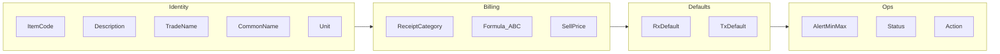
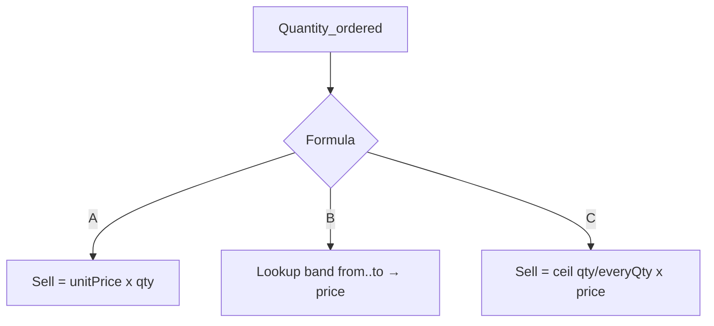
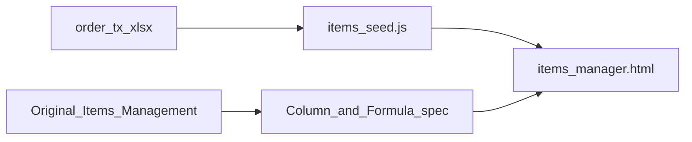
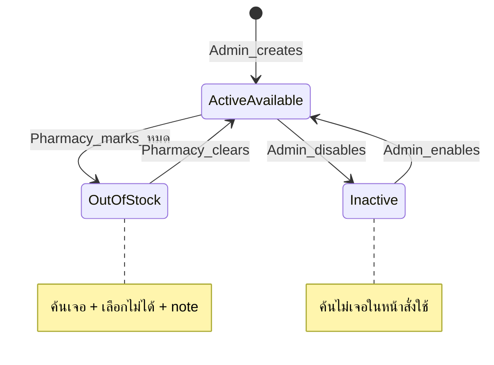
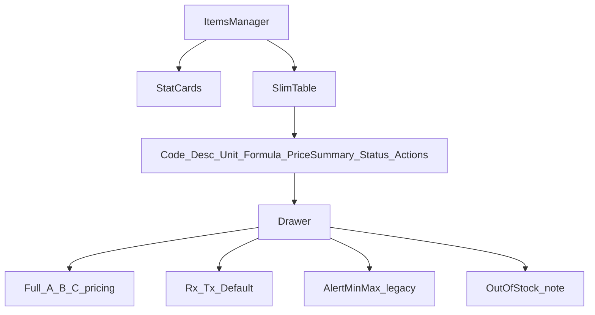
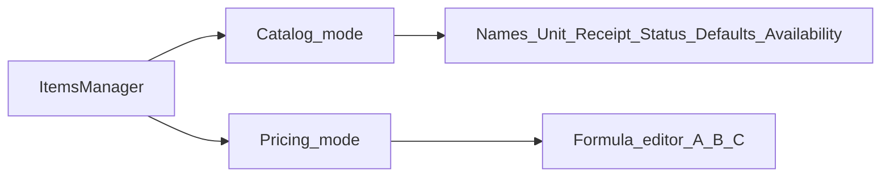
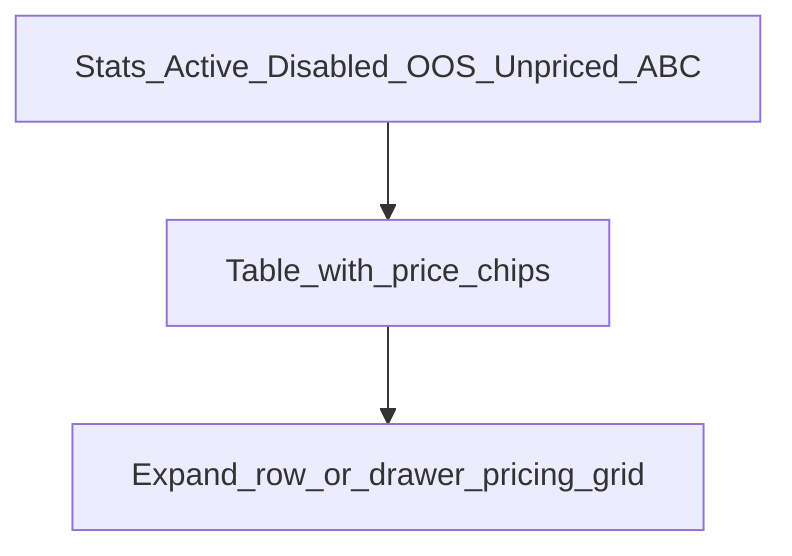
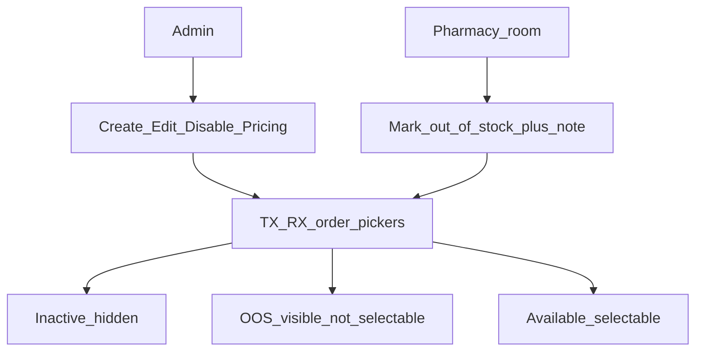

# Items Manager — สรุปออกแบบ (จากของเดิม + ทิศทางใหม่)

เอกสารสรุปภาพรวมหลังวิเคราะห์:

- UI เดิม: Administrator → Items Management  
- ไฟล์ข้อมูลจริง: `resource/order_tx-2026-07-24.xlsx`  
- Mock ปัจจุบัน: `items_picker.html` + แบบ 1/2/3 แยกไฟล์  
- เป้าหมายรอบนี้: **catalog + pricing** (ไม่ใช่คลังยาเต็มระบบ)

---

## 1. คอลัมน์ของเดิม (ครบ 14 ช่อง)

| # | Header | ความหมายสั้น |
| :---: | :--- | :--- |
| 1 | Item Code (รหัส) | รหัสรายการ |
| 2 | Description (ชื่อยา/บริการ) | ชื่อหลัก |
| 3 | Trade Name (ชื่อการค้า) | ชื่อแบรนด์ |
| 4 | Common Name (ชื่อใช้เรียกโดยทั่วไป) | ชื่อเรียกทั่วไป |
| 5 | Unit (หน่วยนับ) | หน่วยคิด/ขาย |
| 6 | Receipt Category (หมวดใบเสร็จ) | หมวดคิดเงิน |
| 7 | Alert Min | เกณฑ์แจ้งเตือนต่ำสุด (กลิ่นคลัง) |
| 8 | Alert Max | เกณฑ์แจ้งเตือนสูงสุด |
| 9 | Formula | สูตรราคา A / B / C |
| 10 | Rx Default | ค่าเริ่มต้นตอนสั่ง RX |
| 11 | Tx Default | ค่าเริ่มต้นตอนสั่ง TX |
| 12 | Sell Price (ราคาขาย) | ราคาที่ตั้ง — รูปแบบตามสูตร |
| 13 | Status | Active / Disabled |
| 14 | Action | Edit |



---

## 2. สูตรราคา A / B / C

นี่คือหัวใจของหน้า Items — **Sell Price ไม่ใช่ตัวเลขเดียวเสมอไป**

| สูตร | ความหมาย | ตัวอย่างการแสดงผลของเดิม |
| :--- | :--- | :--- |
| **A – Unit price** | ราคาต่อหน่วย × จำนวนที่ใช้ | `150.00 / ขวด` |
| **B – Range price** | ราคาตามช่วงจำนวน | `0.01-0.5 = 60; 0.51-1 = 100 +` |
| **C – Every-N price** | ทุกๆ จำนวนคงที่ = ราคาหนึ่งก้อน | เช่น `ทุก 10 เม็ด = 120` *(ใน screenshot ขวาอาจไม่โชว์แถว C ชัด)* |

### โครงข้อมูลที่ควรคิดตอนออกแบบ UI

```text
A: { unitPrice }
B: [ { from, to, price }, ... ]
C: { everyQty, price }
```



**ปัญหา UI เดิม:** เซลล์ Sell Price ของสูตร B อัดข้อความยาว อ่านยากเมื่อมีหลายช่วง

**แนวทางแสดงผลที่แนะนำ**

| ที่ | แสดงอะไร |
| :--- | :--- |
| ตารางหลัก | สรุปสั้น เช่น `150 ฿/ขวด` · `3 ช่วง · เริ่ม 60 ฿` · `ทุก 10 · 120 ฿` |
| Drawer / แผงราคา | รายละเอียดเต็มตามสูตร A/B/C |

---

## 3. แหล่งข้อมูลจริง (Excel Order TX)

ไฟล์: `resource/order_tx-2026-07-24.xlsx`

- Sheet รวม ~337 แถว · **~298 `item_code` ไม่ซ้ำ**
- มี: code, description, category_name, receipt_category, formula, unit  
- **ไม่มี** ราคาบาท / trade / common / rx·tx default ในไฟล์นี้โดยตรง  
- Mock seed ปัจจุบัน: `NP/items/items_seed.js` (จำลองราคาบางส่วนเพื่อโชว์ UI)



---

## 4. สถานะการใช้งาน vs ยาหมด (แยกสิทธิ์)

ไอเดียที่ตกลงแนวคิดไว้: **อย่าให้ห้องยา = Admin**

| ชั้น | ความหมาย | ผู้ทำ | ผลตอนสั่งใช้ |
| :--- | :--- | :--- | :--- |
| **Active + available** | ใช้ได้ปกติ | — | ค้นเจอ · เลือกได้ |
| **ยาหมด / unavailable** | ยังอยู่ในระบบ แต่ใช้ไม่ได้ชั่วคราว | **ห้องยา** | ค้นเจอ · มี note · **เลือกไม่ได้** · เก็บใคร/เมื่อไหร่ |
| **Inactive / Disabled** | ถอดจาก catalog การใช้งาน | **Admin** | **ค้นไม่เจอ** ในมุมสั่งใช้ |



**สองแกนสถานะ (ลดความจุกจิก)**

```text
catalogStatus: active | inactive     ← Admin
availability:  available | out_of_stock  ← ห้องยา
```

อย่าให้ห้องยาแก้ชื่อ / สูตรราคา / Disable catalog

---

## 5. ข้อเสนอ UI 3 แบบ

### แบบที่ 1 — ตารางหลักบาง + Drawer ราคาเต็ม *(แนะนำเริ่ม)*



**เหตุผล:** ใกล้ของเดิม · ทำ mock เร็ว · Sell Price อ่านง่ายในตาราง · รายละเอียดไป Drawer

**ตารางหลักที่แนะนำ**

- Item Code · Description (+ Trade/Common ย่อได้) · Unit · Formula · Sell Price (สรุป) · Status · Action  
- Receipt / Alert / Rx·Tx Default → Drawer หรือไอคอนสั้น

---

### แบบที่ 2 — แยกโหมด Catalog / Pricing



**เหตุผล:** สูตร B/C ต้องการพื้นที่แก้ไขแนวตั้ง · แยกงาน “ดูแลรายการ” กับ “ตั้งราคา”  
**ข้อเสีย:** ผู้ใช้สลับ 2 โหมด

---

### แบบที่ 3 — การ์ดสถิติเด่น + ชิปราคา



**เหตุผล:** สื่อสารสูตรราคาและภาพรวมดีสุดสำหรับพรีเซนต์  
**ข้อเสีย:** ห่างตารางเดิมมากกว่า

---

## 6. ทิศทางที่แนะนำให้ไปต่อ

**ใช้แบบที่ 1 เป็นแกน** แล้วเก็บจุดแข็งแบบ 3 ไว้ที่แผงราคาใน Drawer

1. ตารางไม่โชว์ 14 คอลัมน์พร้อมกัน  
2. Sell Price ในตาราง = สรุปที่อ่านสูตรได้ใน 1 วินาที  
3. แผงราคาเต็มรองรับ A / B / C ตามโครงข้อมูล  
4. Rx Default / Tx Default = สถานะมี/ไม่มี + แก้ใน Drawer  
5. Alert ซ่อนจากตารางหลัก (หรือโชว์เมื่อ ≠ 0)  
6. เพิ่มชั้นยาหมดแยกจาก Disabled (สิทธิ์ห้องยา)



---

## 7. ไฟล์ที่เกี่ยวข้อง

| ไฟล์ | บทบาท |
| :--- | :--- |
| `resource/1787047100395.jpg` | UI เดิม (คอลัมน์ซ้าย) |
| `resource/1787050247157.jpg` | UI เดิม (คอลัมน์ขวา + Sell Price / Defaults) |
| `resource/order_tx-2026-07-24.xlsx` | รายการจริง Order TX |
| `NP/items/items_picker.html` | หน้าเลือกดู mock แต่ละแบบ |
| `NP/items/items_manager.html` | แบบที่ 1 — ตารางบาง + Drawer |
| `NP/items/items_manager_v2.html` | แบบที่ 2 — Catalog / Pricing modes |
| `NP/items/items_manager_v3.html` | แบบที่ 3 — สถิติเด่น + ชิปราคา |
| `NP/items/items_seed.js` | Seed จาก Excel (ใช้ร่วมทุกแบบ) |
| `NP/items/items_manual.md` | คู่มือ mock สั้น |
| `NP/items/items_design_notes.md` | เอกสารนี้ |

---

## 8. นอกขอบเขตรอบออกแบบนี้

- ระบบคลังเต็ม (lot / expiry / receive-issue)  
- ตีความสูตรบัญชีจริงจาก backend ต้นทางทุกเคสขอบ  
- เชื่อม Subjective/Objective ให้ดึง catalog อัตโนมัติ (ทำเป็นรอบถัดไปได้)
