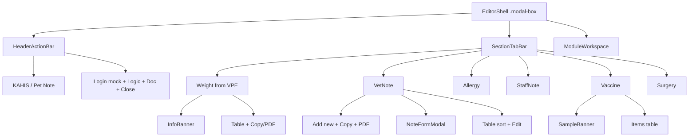

# Pet Note Module — Manual · For Dev · UI Spec (ร่าง)

> เอกสารรวมสำหรับ **ผู้ใช้** และ **Dev** · คู่กับ `petnote.html`  
> UI shell ตามลำดับ: **Board (qmanage)** → **Plan** → **Objective** · อ้าง `NP/editor_ui_shell_map.md`

**สถานะ:** ร่าง + seed ตัวอย่าง — พร้อมปรับปรุงต่อ

---

## 1. Overview (ผู้ใช้)

- **Pet Note** = ฟังก์ชันระดับ **HN** — เปิดเมื่อเข้า HN แล้ว ไม่ผูก visit tab เดียว
- รวม: น้ำหนัก · Vet Note · ประวัติแพ้ยา · Staff Note (บันทึกเจ้าหน้าที่) · ประวัติวัคซีน · ประวัติผ่าตัด
- ขนาด modal มาตรฐาน Plan / Objective: ~`1400px × 95vh`
- **ไม่มี** MetaInfoBar (HN / สายพันธุ์ / logged-in) ใน shell ปัจจุบัน — context HN มาจากหน้าแม่

### ผู้ป่วยตัวอย่างใน mock

| ฟิลด์ | ค่า |
| :--- | :--- |
| HN | `69001234` |
| ชื่อ | บอส |
| สปีชีส์ / เพศ | สุนัข · เพศผู้ |
| อายุ | 5 ปี (ณ 25/08/2026) |
| DOB | 25/08/2021 |

---

## 2. โครง UI (Mermaid)



### ตาราง Layer

| Layer | Logical name | CSS | หมายเหตุ |
| :---: | :--- | :--- | :--- |
| 0 | EditorShell | `.modal-box` | ขนาดมาตรฐาน |
| 1 | HeaderActionBar | `.assess-editor-header` | Brand + Action |
| 1.2 | ActionGroup | `.examcard-bar` | Login mock · Logic · Doc · Close |
| 2 | SectionTabBar | `.visit-tabs` | แท็บหัวข้อ · accent ชมพู |
| 4 | ModuleWorkspace | `.tab-content` | ต่อหัวข้อ |
| 4.1 | PanelToolbar | `.panel-toolbar` | ชื่อตาราง + Add/Copy/PDF |
| 4.2 | AggregateTable | `.data-table` | sort · wrap · `.cell-dt` สำหรับวันเวลา |
| 4.3 | NoteFormModal | `#note-form-modal` | Add / Edit โน้ต |
| 4.4 | SampleBanner | `.sample-banner` | วัคซีน / ผ่าตัด |

---

## 3. คู่มือผู้ใช้ — รายหัวข้อ

### 3.1 น้ำหนัก (จาก VPE)

> บันทึกเพิ่มใช้โมดูล **Vital Sign & PE (VPE)** เท่านั้น

| คอลัมน์ | ความหมาย |
| :--- | :--- |
| Process on | วันเวลาประมวลผล/ตรวจ · ว่าง = ใช้ Created on |
| Wt (kg) | น้ำหนัก |
| Note | Form Note จาก VPE |
| DVM/User | ผู้บันทึก VPE |
| Department | แผนก |
| Created on | เวลาสร้างรายการ |
| Last Update | เวลาแก้ล่าสุด |
| User Update | ผู้แก้ล่าสุด |

เครื่องมือ: **Copy** · **PDF (mock)** · คลิกหัวคอลัมน์เพื่อ sort

### 3.2 Vet Note · ประวัติแพ้ยา · Staff Note

ตารางคอลัมน์เหมือนกันทั้ง 3 แท็บ:

| คอลัมน์ | ความหมาย |
| :--- | :--- |
| Record on | เวลาบันทึก |
| ข้อความ | เนื้อหา (ขึ้นบรรทัดใหม่ได้) |
| Level | เขียว / เหลือง / แดง |
| User | ผู้บันทึก |
| Department | แผนก |
| Status | Active / Disable |
| Update | เวลาแก้ล่าสุด |
| Update by | ผู้แก้ล่าสุด |
| Action | Edit |

- **+ Add new** / **Edit** → เปิด modal (ข้อความ + Level · Disable ตอนแก้)
- สิทธิ์แก้/Disable: **เจ้าของรายการ** หรือ **Admin**
- Copy / PDF เช่นเดียวกับแท็บอื่น

แท็บนี้คือ **Staff Note** / **บันทึกเจ้าหน้าที่** — โน้ตจาก user ระดับเจ้าหน้าที่ (ต้อนรับ · การเงิน · แอดมินคลินิก ฯลฯ) ไม่ใช่ DVM · แยกแผนกด้วยคอลัมน์ Department

### 3.3 ประวัติวัคซีน & ถ่ายพยาธิ

> **ข้อมูลเป็นเพียงตัวอย่าง (seed · AAHA-inspired)** — เมื่อระบบ items สมบูรณ์ สามารถสร้าง Tag ของ item ต่างๆได้ โดยส่วนนี้ดึง items ที่มี tag `vaccine`, `deworm`

| คอลัมน์ | ความหมาย |
| :--- | :--- |
| Process on | ว่าง → แสดง Created on (ไม่โชว์ข้อความ “= record on”) |
| อายุโดยประมาณ | จาก DOB · รูปแบบ `- ปี 2 เดือน - วัน` |
| รายการ | ชื่อ item |
| Tag | vaccine / deworm |
| Note | จาก **TX label** ของ item |
| DVM/User | ผู้เกี่ยวข้อง |
| Department | แผนก |
| Created on | เวลาสร้าง |
| Last Update | เวลาแก้ |
| User Update | ผู้แก้ |

ไม่มีคอลัมน์ **แหล่ง**

### 3.4 ประวัติผ่าตัด

โครงคอลัมเท่าวัคซีน · tag `surgery` · sample banner ระบุ `(seed)`

---

## 4. For Dev — Scope & Data Contract (ร่าง)

### 4.1 ขอบเขต

| ส่วน | เขียนใน Pet Note | แหล่ง |
| :--- | :---: | :--- |
| Weight | อ่านอย่างเดียว | VPE |
| Vet / Allergy / Staff Note | ✓ modal | PetNote service |
| Vaccine / Deworm / Surgery | อ่านอย่างเดียว | Items + TX label note |

### 4.2 Data shapes (ร่าง)

```
WeightFromVpe {
  id: string
  processOn?: string      // null → sort/display ใช้ createdOn
  createdOn: string
  kg: number
  note?: string
  user: string            // DVM/User
  department: string
  lastUpdate?: string
  updateBy?: string       // User Update
}

PetNoteMessage {
  id: string
  hn: string
  type: 'vet' | 'allergy' | 'staff'
  recordOn: string
  text: string
  level: 'green' | 'yellow' | 'red'
  user: string
  department: string
  status: 'active' | 'disable'
  updateOn?: string
  updateBy?: string
}

ItemHistoryRow {
  processOn?: string
  createdOn: string
  title: string
  tag: 'vaccine' | 'deworm' | 'surgery'
  note?: string           // TX label note
  user: string
  department: string
  lastUpdate?: string
  updateBy?: string
}
```

### 4.3 Business rules

1. Weight ไม่สร้าง/แก้ใน Pet Note — ไป VPE  
2. เรียง Weight / Items ตาม `processOn || createdOn`  
3. Edit/Disable โน้ต: `currentUser === row.user` หรือ `admin`  
4. Disable / Apply แก้ → stamp update fields · ไม่เปลี่ยนเจ้าของ  
5. Copy = plain text แถว คั่นคอลัมน์ด้วย `|` (ตัดคอลัมน์ Action)  
6. PDF = mock  
7. Date/time ในตารางใช้คลาส `.cell-dt` (monospace + `tabular-nums`)

### 4.4 UI — ให้คอลัมน์วันเวลาดูเท่ากัน

ปรับที่ **CSS ของเซลล์วันเวลา** ไม่จำเป็นต้องเปลี่ยน font ทั้งหน้า:

| สิ่งที่ปรับ | ทำไม |
| :--- | :--- |
| `font-family: ui-monospace, … monospace` | ตัวเลขแต่ละหลักกว้างคงที่ · วันที่เรียงแนวตั้งสวย |
| `font-variant-numeric: tabular-nums` | บังคับตัวเลขแบบตาราง แม้ใช้ font สัดส่วน |
| `white-space: nowrap` | ไม่หักบรรทัดกลางวันเวลา |
| รูปแบบข้อความคงที่ `dd/mm/yyyy HH:mm` | ความยาวสตริงเท่ากันทุกแถว |
| ความกว้างคอลัมน์ `table-layout: fixed` + `%` | คอลัมน์วันเวลาไม่ถูกบีบไม่เท่ากัน |

ใน mock ใช้คลาส `.cell-dt` แล้ว

### 4.5 Open questions

- Allergy โครงสร้างยา vs free-text  
- VPE / Items sync realtime vs ตอนเปิด Pet Note  

---

## 5. Seed สรุป

| หัวข้อ | ~แถว | ไฮไลต์ |
| :--- | :---: | :--- |
| น้ำหนัก | 12 | Process on ว่างได้ · scrollbar |
| Vet Note | 15 | modal · Disable |
| แพ้ยา | 8 | header เท่ากัน |
| Staff Note | 12 | staff role |
| วัคซีน+ถ่ายพยาธิ | 20 | AAHA-inspired ใน banner |
| ผ่าตัด | 4 | คอลัมเท่าวัคซีน |

---

## 6. ไฟล์ที่เกี่ยวข้อง

| ไฟล์ | บทบาท |
| :--- | :--- |
| `NP/petnote/petnote.html` | Mock UI + Logic/Rule |
| `NP/petnote/petnote.md` | เอกสารนี้ |
| `NP/editor_ui_shell_map.md` | Logical / CSS ร่วม |
| `NP/vital_pe/` | แหล่งน้ำหนัก |
| `NP/plan/plan_editor.html` | Level Symbol ต้นแบบ |

---

## 7. ประวัติ

| วันที่ | เปลี่ยน |
| :--- | :--- |
| 2026-08-25 | ร่างแรก — mock + seed |
| 2026-08-25 | น้ำหนักจาก VPE · โน้ต User/Dept/Status/Update + Disable |
| 2026-08-25 | sort · seed เพิ่ม · อายุ YMD · Note จาก TX label |
| 2026-08-25 | เอา MetaInfoBar · Copy/PDF · Add/Edit modal |
| 2026-08-25 | คอลัมน์ Created/Last Update/User Update · เอาแหล่งออก |
| 2026-08-25 | อัปเดต Logic/Rule + md · `.cell-dt` · เปลี่ยนชื่อเป็น Staff Note |
