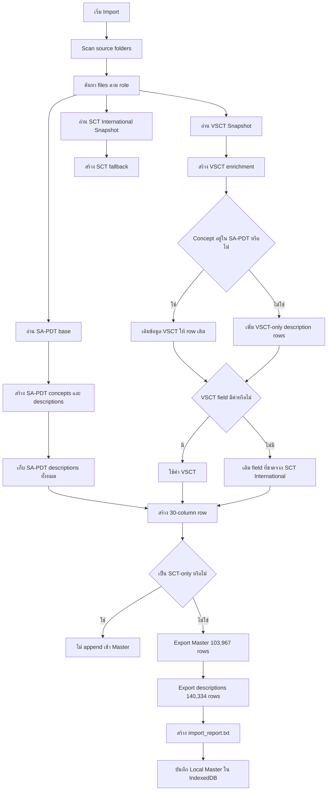
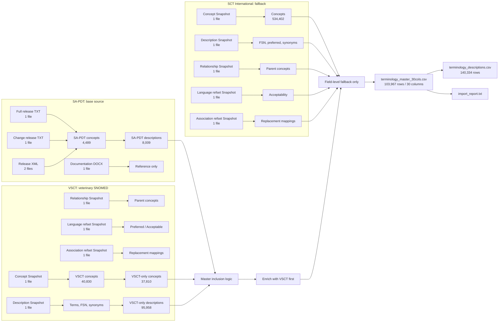
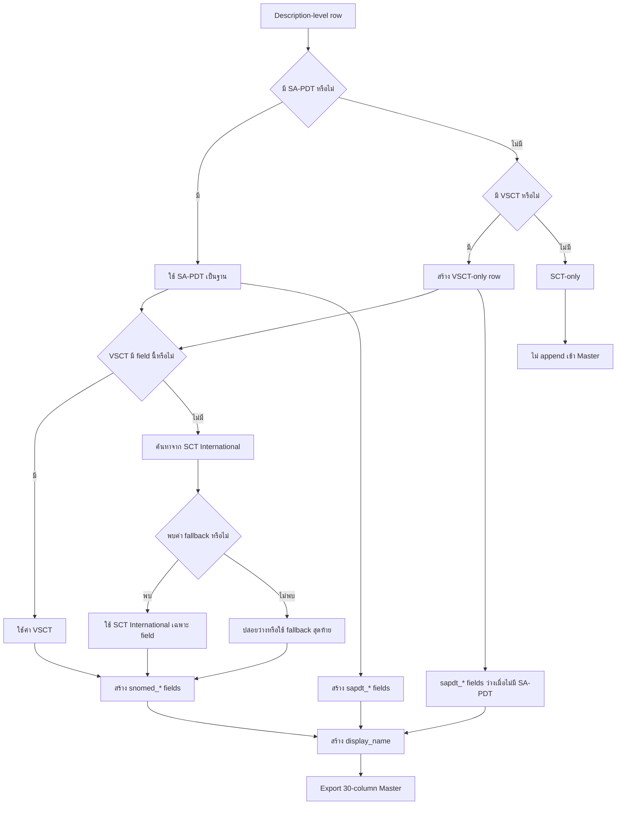

# KAHIS terminology master

## 1. วัตถุประสงค์

`KAHIS_terminology_master` เป็น Local Web Application สำหรับสร้างและดูแล terminology master ของ KAHIS จาก 3 แหล่งข้อมูล:

- SA-PDT (Small Animal Problem and Diagnosis Terms)
- VSCT (SNOMED CT Veterinary Extension)
- SCT International (SNOMED CT International Edition)

ระบบทำงานใน browser บนเครื่องผู้ใช้ ไม่ใช้ server ภายนอก ไม่ส่ง source files ออกออนไลน์ และไม่ต้อง unzip ZIP ใน browser

## 2. หลักการสำคัญ

```text
Local Concept record = หนึ่ง row ต่อหนึ่ง Concept
Description record = หนึ่ง row ต่อหนึ่ง Description
terminology_master_30cols.csv = หนึ่ง row ต่อหนึ่ง Description-level output record
หนึ่ง Concept อาจมีหลาย Description
source data แยก SA-PDT, VSCT และ SCT International
synonym_alias เป็นคำเพิ่มเติมระดับระบบที่ Admin ดูแล
```

ตัวอย่าง:

```text
Concept: 350281000009108
├── 930711000009119 | Coccygeal agenesis | Preferred
└── 930701000009116 | Tail absent         | Acceptable
```

ไม่ควรรวม Description หลายคำเป็นข้อความเดียวใน source table

## 3. โครงสร้างโครงการ

```text
terminology_builder/
├── app/
│   ├── index.html
│   ├── styles.css
│   └── production.js
├── docs/
│   └── KAHIS_terminology_master.md
├── Small Animal Problem and Diagnosis Terms/
├── SnomedCT_VETExtension_*/
└── SnomedCT_InternationalRF2_*/
```

ไม่มี `output/` folder ใน workflow นี้ ไฟล์ export จะถูกดาวน์โหลดโดย browser ไปยัง Downloads

## 4. การเปิด Application

เปิดไฟล์:

```text
app/index.html
```

แนะนำ Chrome หรือ Edge รุ่นปัจจุบันที่รองรับ `webkitdirectory`, IndexedDB และ file download

ไม่ต้องติดตั้ง package และไม่ต้องเปิด server

## 5. การเลือก Source folders

เลือก folder ที่มีข้อมูลตามลำดับ:

1. **SA-PDT** — folder ที่มี TXT/XML release เช่น `SA-PDT Apr 2026 Release/`, `SA-PDTReleaseFile_full_20260331.txt`, `SA-PDTReleaseFile_20250401to20260331.txt`
2. **VSCT** — root folder ของ SNOMED CT Veterinary Extension RF2
3. **SCT International** — root folder ของ SNOMED CT International RF2
4. **Existing database** — เลือกเมื่อมี CSV/JSON/JSONL จากรอบก่อน ต้องการ migrate หรือ update

ไม่จำเป็นต้องตั้งชื่อไฟล์ให้ตรงวันที่หรือ module version ระบบใช้ pattern จาก path, filename และ header

## 6. Pattern ที่ระบบค้นหา

### SA-PDT

```text
SA-PDTReleaseFile_full*.txt
SA-PDTReleaseFile_*to*.txt
*.xml ที่มีคำว่า releasefile หรือ SA-PDT
SA-PDT Document.docx
```

หน้าที่ของไฟล์:

- `full release TXT` — source หลักของ Concept และ Description
- `change release TXT` — New/Changed/Retired information
- `XML` — release source/validation ที่รองรับตามรูปแบบไฟล์
- `DOCX` — เอกสารอ้างอิง ไม่ใช่ source หลักของการ import

### VSCT และ SCT International

ไฟล์ที่ใช้ในการ Import operational Master ต้องเป็นชุด `Snapshot`:

```text
sct2_Concept_Snapshot*.txt
sct2_Description_Snapshot-en*.txt
sct2_Relationship_Snapshot*.txt
der2_cRefset_LanguageSnapshot-en*.txt
der2_cRefset_AssociationSnapshot*.txt
```

#### Full กับ Snapshot ต่างกันอย่างไร

| ชุดไฟล์ | ความหมาย | ใช้ทำอะไร | ใช้สร้าง Master ปัจจุบันหรือไม่ |
|---|---|---|---|
| `Full` | เก็บประวัติ component หลาย release/หลาย effectiveTime รวม active และ inactive rows | Audit, release comparison, ประวัติการเปลี่ยนแปลง, ตรวจว่า term ถูกสร้าง/แก้/ยกเลิกเมื่อใด | ไม่ควรใช้โดยตรง |
| `Snapshot` | เก็บสถานะล่าสุดของ component ณ release นั้น โดยเหลือ row สถานะปัจจุบัน | Operational lookup และสร้าง Master ของ release ปัจจุบัน | ใช้ |

ตัวอย่างจาก VSCT release ปัจจุบัน:

```text
Concept Full                 37,424 rows รวม header
Concept Snapshot             37,417 rows รวม header
Description Full-en        102,742 rows รวม header
Description Snapshot-en    102,581 rows รวม header
Relationship Full           63,446 rows รวม header
Relationship Snapshot       63,161 rows รวม header
Language Full-en           180,444 rows รวม header
Language Snapshot-en       179,853 rows รวม header
```

`Full` มี rows มากกว่าเพราะเก็บประวัติเดิมไว้ ส่วน `Snapshot` มีเฉพาะสถานะที่ต้องใช้ใน release ปัจจุบัน การนำ Full และ Snapshot มารวมกันจะทำให้เกิด duplicate และอาจนำข้อมูลเก่าหรือ inactive มาใช้ผิดสถานะ

**กฎใช้งาน:** เลือก Snapshot ของ release เดียวกันทั้งชุดเสมอ และเก็บ Full ของ release เดียวกันไว้เป็นหลักฐานประกอบ ไม่ต้องนำ Full เข้า Import พร้อม Snapshot

## 7. Mermaid diagrams: workflow และ data lineage

ตัวเลขใน diagrams นี้มาจาก `sample_test` release ที่ตรวจสอบแล้ว:

```text
SA-PDT concepts              : 4,489
SA-PDT descriptions         : 8,009
VSCT concepts                : 40,830
VSCT-only concepts           : 37,810
VSCT-only descriptions      : 95,958
SCT International concepts   : 534,402
Master rows                  : 103,967
Imported descriptions        : 140,334
```

### 7.1 Import workflow



### 7.2 Source files ไปเป็นข้อมูลประเภทใด



### 7.3 Field-level source priority



หลักการสำคัญของ diagrams:

- `SA-PDT` เป็นฐานของ Master
- `VSCT` มี priority ก่อน `SCT International` สำหรับ SNOMED enrichment
- `SCT International` ใช้เติมเฉพาะ field ที่ VSCT ไม่มีค่า
- `SCT-only` ไม่ถูกเพิ่มเป็น Master row ใหม่
- Output หลักเป็น Description-level ไม่ใช่ Concept-level

## 8. ปุ่มและส่วนต่าง ๆ ของ Application

### 8.1 `Scan sources / Import Master`

เป็นปุ่มหลัก ใช้:

```text
ค้นหาไฟล์
→ อ่าน source
→ สร้างหรืออัปเดต Concept/Description
→ บันทึก Local Master
→ สร้าง import history
```

ถ้าไม่มีฐานเดิมจะเป็น `initial_build` ถ้ามีข้อมูลเดิมจะเป็น `update_existing_database`

ระหว่างทำงานจะแสดง:

- source ที่กำลังอ่าน
- ชื่อไฟล์
- ขั้นตอน parse หรือสร้าง records
- จำนวน rows
- progress percentage
- error ถ้ามี

ไม่ควรปิด tab หรือ refresh ระหว่าง import

### 8.2 `Clear Local Master`

ใช้ลบข้อมูล Local Master ใน browser เครื่องนี้เท่านั้น

เมื่อกดจะมี confirmation และถ้ายืนยันจะลบ:

```text
concepts
descriptions
synonym_alias
imports
```

จะไม่ลบ:

- SA-PDT source files
- VSCT source files
- SCT International source files
- ไฟล์ที่ดาวน์โหลดไว้ใน Downloads

การลบไม่สามารถ undo ได้ ควร export backup ก่อน

### 8.3 Preview

ใช้ตรวจตัวอย่าง Description ที่นำเข้าได้ ไม่ใช่ข้อมูลทั้งหมด

ตรวจได้ว่า:

- Concept ID ถูกต้อง
- Description ID ถูกต้อง
- Term ถูกต้อง
- Preferred/Acceptable ถูกต้อง
- source ถูกต้อง
- Active status ถูกต้อง

### 8.4 `เพิ่ม synonym_alias`

ใช้โดย Admin เพื่อเพิ่มคำค้นเพิ่มเติมระดับระบบ

กรอก:

```text
Concept ID
คำพ้องหรือคำค้นเพิ่มเติม
ประเภทคำ
```

ประเภทที่รองรับ:

```text
synonym
clinical
abbreviation
local
```

`synonym_alias` ไม่ใช่ synonym ส่วนตัวของ user และจะถูกเก็บใน Local Master ร่วมกันทั้งระบบ

### 8.5 `Export MAIN: concept master CSV`

เป็น output หลักแบบ 30 columns หนึ่ง row ต่อหนึ่ง Description-level output record ใช้สำหรับ backup, ตรวจสอบ และเป็นฐานสำหรับส่งต่อ HIS หลังยืนยัน schema

### 8.6 `Export detail: descriptions CSV`

เป็น output รายละเอียด หนึ่ง row ต่อหนึ่ง Description ใช้ตรวจสอบคำศัพท์, Description ID, source และ designation

### 8.7 `Export REPORT: import report`

เป็นรายงานตรวจสอบ ไม่ใช่ terminology master และไม่ควรนำเข้า HIS โดยตรง

## 9. การเก็บข้อมูล

### ระหว่าง Scan

ข้อมูลที่กำลังประมวลผลอยู่ใน RAM ชั่วคราว เช่น preview และ arrays ของ records

### หลัง Import สำเร็จ

ข้อมูลจะถูกเก็บใน IndexedDB ของ browser:

```text
Database: KAHIS_terminology_master
├── concepts
├── descriptions
├── synonym_alias
└── imports
```

IndexedDB ไม่ใช่ `localStorage` และเหมาะกับข้อมูลจำนวนมากกว่า

### ต้องเคลียร์ cache หรือไม่

ไม่ต้องเคลียร์ cache ในการใช้งานปกติ

ห้ามใช้ `Clear browsing data` หรือ `Clear cookies and site data` โดยไม่ backup เพราะอาจลบ IndexedDB และ Local Master ได้

ถ้าต้องการเริ่มใหม่ให้ใช้ปุ่ม `Clear Local Master` โดยตรง

## 10. Initial build

กรณีไม่มี Local Master เดิม:

```text
เลือก source folders
→ Scan sources / Import Master
→ สร้าง concepts
→ สร้าง descriptions
→ อ่าน VSCT/SCT International
→ อ่าน Language Refset
→ สร้าง source flags
→ บันทึก IndexedDB
→ Export เมื่อจำเป็น
```

## 11. Update existing database

### แนวทางเมื่อมี release ใหม่ในอนาคต

1. สร้าง directory ใหม่ตาม release date ห้ามเขียนทับ directory เดิม
2. เก็บทั้ง `Full` และ `Snapshot` ของ release เดียวกันไว้เป็น package เดียวกัน
3. ใช้เฉพาะ `Snapshot` ในการสร้าง operational Master
4. ตรวจสอบ module ID, release date, language และ header ของทุก RF2 file ก่อน Import
5. Export Master, detail และ detailed report ของ release เดิมก่อน Update
6. Import Snapshot ชุดใหม่ แล้วจับคู่ด้วย Concept ID และ Description ID
7. ตรวจจำนวน SA-PDT descriptions, VSCT-only descriptions, active state, retired concepts และ replacement mappings
8. เปรียบเทียบ Master เก่ากับใหม่ก่อนส่งต่อ HIS
9. เก็บไฟล์ source, Full, Snapshot, Master และ report ไว้ด้วยกัน โดยใช้ release date เดียวกัน

กรณีมี Local Master เดิมหรือ Existing database:

```text
อ่านฐานเดิม
→ อ่าน Snapshot release ใหม่
→ จับคู่ด้วย Concept ID และ Description ID
→ อัปเดต source data
→ เพิ่ม Description ใหม่
→ คง display_name ที่ Admin แก้ไขไว้ตาม policy
→ เก็บ synonym_alias เดิม
→ เก็บ created_at เดิม
→ บันทึก updated_at ใหม่
→ บันทึก import history
```

กฎสำคัญ:

- Concept เดิมใช้ `display_name` เดิมถ้ามี
- `synonym_alias` ที่ Admin เพิ่มแล้วต้องไม่ถูกเขียนทับ
- Source Description อัปเดตตาม release ใหม่
- Concept retired ไม่ควรถูกลบ ให้เปลี่ยนเป็น inactive
- ข้อมูล source เดิมต้องตรวจสอบย้อนหลังได้

## 12. Source data และการเลือกข้อมูล

### SA-PDT

ใช้ข้อมูล:

```text
Status
Concept Identifier
Description Identifier
Description Term
Term Designation
```

### VSCT/SCT International Concept

ใช้ข้อมูล:

```text
id
effectiveTime
active
moduleId
definitionStatusId
```

### Description

ใช้ข้อมูล:

```text
description id
concept id
language code
type id
term
module id
active
```

### Language Refset

ใช้ `referencedComponentId` เพื่อบอกว่า Description ใดเป็น:

```text
Preferred
Acceptable
```

### Description type

ระบบแยก:

```text
FSN
Synonym
Description
```

FSN ใช้ semantic tag เช่น `(disorder)` หรือ `(finding)`

## 13. Source priority และการ match

ลำดับความสำคัญของข้อมูล:

```text
1. SA-PDT = ชุด Concept หลัก
2. VSCT = เติมข้อมูล/เทียบข้อมูล และต่อท้ายเฉพาะ Concept ที่ไม่มีใน SA-PDT
3. SCT International = fallback เมื่อไม่มีข้อมูลจาก VSCT
```

กฎการมีแถวใน MAIN master:

```text
Master rows = SA-PDT concepts ∪ VSCT-only concepts
SCT-only concepts ไม่ถูกต่อท้ายเป็นแถวใหม่
SCT International ใช้เติมข้อมูลให้ Concept ที่อยู่ใน SA-PDT หรือ VSCT เท่านั้น
```

จาก release ที่อยู่ใน workspace ปัจจุบัน:

```text
SA-PDT concepts              4,489
VSCT concepts                37,416
SA-PDT ∩ VSCT                 1,599
VSCT-only concepts           35,817
ประมาณการ MAIN master rows  40,306
```

จำนวนจริงหลัง import อาจต่างจากประมาณการเมื่อเปลี่ยน release, มี duplicate หรือมี active/inactive filtering เพิ่ม

เมื่อ Concept เดียวกันพบในหลาย source:

```text
SA-PDT fields ใช้ SA-PDT เป็นหลัก
ถ้าไม่มีข้อมูลจาก SA-PDT ให้ใช้ VSCT
ถ้าไม่มี VSCT ให้ใช้ SCT International
```

Flag `in_vsct` และ `in_sct_int` บอกว่ามี Concept นั้นใน source หรือไม่ ส่วน `match_type` และ `match_confidence` บอกวิธี match

Concept ID match มีความมั่นใจสูงสุด การ match จากข้อความต้องเก็บ match type และควรมี review สำหรับกรณีหลาย Concept

## 14. ตารางข้อมูลหลัก

### `concepts`

หนึ่ง row ต่อหนึ่ง Concept:

```text
concept_key
concept_id
display_name
in_sapdt
in_vsct
in_sct_int
record_status
sapdt_status
sapdt_change_type
vsct_active
vsct_module_id
vsct_definition_status_id
sct_int_active
sct_int_module_id
sct_int_definition_status_id
description_count
source_release
created_at
updated_at
```

### `descriptions`

หนึ่ง row ต่อหนึ่ง Description:

```text
description_key
source
concept_id
description_id
term
description_type
designation
active
module_id
semantic_type
source_file
```

### `synonym_alias`

ข้อมูล Admin ระดับระบบ:

```text
alias_id
concept_id
alias_text
alias_type
status
is_searchable
managed_by
created_at
```

### `imports`

ประวัติการ import:

```text
import_id
mode
imported_at
concept_count
description_count
discovered_file_count
```

## 15. Output files

Browser จะ download ไฟล์ไปยัง Downloads

### `terminology_master_30cols.csv`

ไฟล์ข้อมูลหลักที่ต้องใช้เป็น output หลักของระบบ มี **หนึ่ง row ต่อหนึ่ง Description**

กฎจำนวนแถว:

```text
SA-PDT descriptions ทั้งหมด
+ VSCT descriptions ของ Concept ที่ไม่มีใน SA-PDT
SCT-only descriptions ไม่ถูกต่อท้ายเป็นแถวใหม่
```

จาก release ปัจจุบันคาดว่าจะได้ประมาณ:

```text
8,009 SA-PDT descriptions
+ 95,958 VSCT-only descriptions
= 103,967 rows โดยประมาณ
```

ข้อมูลของ Concept เดิมจาก VSCT/SCT International จะถูกเติมซ้ำในแต่ละ Description row ที่เกี่ยวข้อง เพื่อให้แต่ละ row ใช้งานได้ครบในตัวเอง

### ความหมายของ 30 คอลัมน์

| ลำดับ | คอลัมน์ | ความหมาย |
|---:|---|---|
| 1 | `display_name` | ชื่อ Concept หลักที่ใช้แสดง; ใช้ SA-PDT ก่อน แล้ว fallback เป็น VSCT/SCT |
| 2 | `in_sapdt` | ระบุว่า Description row นี้มาจาก SA-PDT หรือไม่ |
| 3 | `in_vsct` | ระบุ Concept นี้มีอยู่ใน VSCT หรือไม่ |
| 4 | `in_sct_inter` | ระบุ Concept นี้มีอยู่ใน SCT International หรือไม่ |
| 5 | `sapdt_concept_id` | Concept ID ของ SA-PDT; ว่างใน VSCT-only row |
| 6 | `sapdt_status` | สถานะ Concept/Description ฝั่ง SA-PDT เช่น Active หรือ Retired |
| 7 | `sapdt_change_type` | ประเภทการเปลี่ยนแปลงจาก SA-PDT เช่น New Concept, Changed, Retired |
| 8 | `sapdt_description_id` | Description ID ของ SA-PDT ใน row ปัจจุบัน |
| 9 | `sapdt_fsn` | FSN ฝั่ง SA-PDT ถ้ามีข้อมูล |
| 10 | `sapdt_preferred` | Preferred term ของ SA-PDT; ใน Preferred row คือ term ของ row นั้น |
| 11 | `sapdt_acceptable` | Acceptable term ของ SA-PDT; ใน Acceptable row คือ term ของ row นั้น |
| 12 | `synonym` | คำ synonym ของ row รวม source synonym และคำที่ Admin เพิ่มใน `synonym_alias` |
| 13 | `sapdt_semantic_type` | Semantic type ฝั่ง SA-PDT ถ้ามีข้อมูล |
| 14 | `snomed_concept_id` | Concept ID จาก VSCT ก่อน; ถ้าไม่มีจึงใช้ SCT International |
| 15 | `snomed_fsn` | FSN จาก SNOMED source ที่ถูกเลือก |
| 16 | `snomed_preferred_term` | Preferred term จาก SNOMED source; ใน VSCT Preferred row คือ term ของ row นั้น |
| 17 | `snomed_all_synonyms` | Synonyms จาก SNOMED source; ใน VSCT Synonym row คือ term ของ row นั้น |
| 18 | `snomed_active` | สถานะ Active ของ SNOMED Concept |
| 19 | `snomed_module` | Module ID ของ SNOMED Concept |
| 20 | `snomed_semantic_type` | Semantic tag จาก FSN เช่น disorder หรือ finding |
| 21 | `snomed_definition_status` | Definition status เช่น Primitive หรือ Fully defined |
| 22 | `snomed_parent_concepts` | Parent Concept IDs จาก Relationship RF2 |
| 23 | `match_type` | วิธีจับคู่ เช่น Concept ID match หรือ No match |
| 24 | `concept_count` | จำนวน SNOMED Concept ที่จับคู่กับ row นี้ |
| 25 | `all_snomed_concept_ids` | SNOMED Concept IDs ที่เกี่ยวข้องกับ row นี้ |
| 26 | `replacement_concept_id` | Concept ใหม่ที่ใช้แทน Concept retired ถ้ามี Association mapping |
| 27 | `match_confidence` | ระดับความมั่นใจของการ match เช่น Exact หรือ None |
| 28 | `updated_at` | วันเวลาที่ record ถูก update |
| 29 | `updated_by` | ผู้หรือระบบที่ update เช่น system |
| 30 | `created_at` | วันเวลาที่สร้าง record ครั้งแรก |

### ตัวอย่างระดับข้อมูล

```text
SA-PDT Concept 350281000009108
├── Description 930711000009119 | Coccygeal agenesis | Preferred
└── Description 930701000009116 | Tail absent         | Acceptable
```

ผลลัพธ์จะเป็น 2 rows ไม่ใช่ 1 row และทั้งสอง row จะมี `concept_id` เดียวกัน แต่มี `description_id` และ term ต่างกัน

### `terminology_descriptions.csv`

ไฟล์รายละเอียดดิบแบบ normalized หนึ่ง row ต่อหนึ่ง Description ใช้ตรวจสอบ source โดยตรง

### `import_report.txt`

รายงานสรุปแบบ plain text สำหรับอ่านด้วยคนและเก็บเป็น release evidence โดยมี:

- รายละเอียด release และเวลา Import
- Mode ของการทำงาน
- ชื่อและ path ของ source file ที่ถูกใช้จริง
- Role และขนาดของแต่ละ source file
- ความแตกต่างระหว่าง RF2 Full และ Snapshot
- Source priority และ Master inclusion rule
- จำนวน Concept/Description ของแต่ละ source
- จำนวน rows ที่นำไปสร้าง Master
- Logic การเติมข้อมูลรายคอลัมน์
- แนวทาง Update release ในอนาคต
- Warning และรายการตรวจสอบ

ไฟล์ MAIN เป็น flattened export สำหรับ backup/ตรวจสอบ/ส่งต่อ HIS ส่วน IndexedDB เป็นฐานข้อมูลที่ Application ใช้งานระหว่างรอบ

## 16. HIS handoff

ก่อนส่งให้ Developer HIS ต้องยืนยัน:

- ชื่อ column
- primary key
- active/inactive mapping
- display name ที่ต้องใช้
- search term format
- source fields ที่ต้องการ
- replacement concept behavior
- effective date
- encoding และ delimiter

โดยทั่วไป:

```text
Master export = file หลักแบบ Description-level
Description export = file รายละเอียด normalized สำหรับตรวจสอบและสร้าง search index
import report = เอกสารตรวจสอบ
```

## 17. Retired และ Replacement

Concept ที่ retired ไม่ควรถูกลบจาก Local Master:

```text
record_status = inactive
```

ควรรักษา:

```text
retired_at
retired_source
replacement_concept_id
replacement_source
```

Association Refset ใช้ช่วยระบุ Concept ที่มาแทน Concept เดิม

## 18. Relationship และ Hierarchy

Relationship ใช้สำหรับ:

- parent concept
- child concept
- hierarchy
- terminology browser
- การจัดกลุ่มข้อมูล

อาจเก็บใน Master แม้ HIS รุ่นแรกจะไม่ใช้ใน export

## 19. Backup และการกู้คืน

ก่อนทำ release update หรือ Clear Local Master:

1. Export `terminology_master_30cols.csv`
2. Export `terminology_descriptions.csv`
3. Export `import_report.txt`
4. เก็บ source release เดิมไว้
5. ระบุวันที่และ release ให้กับไฟล์ backup

ตัวอย่างชื่อ backup:

```text
KAHIS_master_20260331.csv
KAHIS_descriptions_20260331.csv
KAHIS_import_report_20260331.txt
```

## 20. Troubleshooting

### Scan ดูเหมือนค้าง

- ตรวจ progress file และ row count
- ไฟล์ SCT International Description อาจมีมากกว่าหนึ่งล้าน rows
- หลัง parse จะมีขั้นสร้าง records และบันทึก IndexedDB
- อย่าปิด tab ระหว่างทำงาน

### Progress ถึงเกือบ 100% แล้วช้า

ระบบอาจกำลังทำขั้นตอน:

```text
สร้าง Description records
จับคู่ Concept
บันทึก IndexedDB
สร้าง report
```

### เปิดใหม่แล้วข้อมูลหาย

ตรวจว่า browser ถูกล้าง site data หรือไม่ และตรวจว่า import ครั้งก่อนเสร็จสมบูรณ์หรือไม่

### ไม่พบไฟล์

ตรวจ:

- เลือก folder ถูกระดับหรือไม่
- ไฟล์ถูกแตก ZIP แล้วหรือไม่
- ชื่อไฟล์มี header ถูกต้องหรือไม่
- ใช้ Snapshot หรือ Full release ที่รองรับหรือไม่

### Source file ไม่ครบ

ระบบจะแสดง warning ใน import report ควรแก้ source folder แล้ว Scan ใหม่

## 21. ข้อจำกัด

- ต้องแตก ZIP ก่อนเลือก folder
- DOCX ใช้เป็นเอกสารอ้างอิง ไม่ใช่ source หลัก
- Browser ไม่เขียนไฟล์ลง folder อัตโนมัติ ปุ่ม Export จะ download ไปยัง Downloads
- IndexedDB ผูกกับ browser และเครื่องนั้น ต้อง backup ก่อนย้ายเครื่อง
- HIS integration ต้องยืนยัน contract กับทีม HIS
- การเปิดไฟล์โดยตรงเหมาะกับการใช้งาน local; หาก browser จำกัด IndexedDB ให้ใช้ browser ที่รองรับหรือ local static serving ตามนโยบายองค์กร

## 22. Workflow แนะนำ

```text
1. Download release จาก source website
2. แตก ZIP ด้วยระบบปฏิบัติการ
3. เปิด app/index.html
4. เลือก SA-PDT folder
5. เลือก VSCT folder
6. เลือก SCT International folder
7. เลือก Existing database ถ้ามี
8. กด Scan sources / Import Master
9. รอจนสถานะเสร็จสิ้น
10. ตรวจ Preview และ import report
11. เพิ่ม synonym_alias ถ้าจำเป็น
12. Export MAIN master และ detail เมื่อจำเป็น
13. เก็บไฟล์ backup พร้อม release date
```

## 23. สรุป

```text
RAM = ข้อมูลระหว่างกำลังประมวลผล
IndexedDB = Local Master หลัง Import สำเร็จ
localStorage = ไม่ได้ใช้
Clear cache = ไม่ต้องทำในการใช้งานปกติ
Clear Local Master = ล้างข้อมูล IndexedDB โดยมี confirmation
MAIN export = terminology_master_30cols.csv
Detail export = terminology_descriptions.csv
Report = import_report.txt
Source files = ต้นฉบับ ห้ามแก้ไข
```
